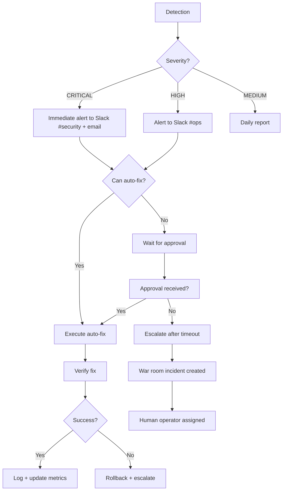

# Enforcement Expansion Report — Wheeler Ecosystem

**Date:** 2026-05-24
**Author:** Wheeler Enforcement Agent
**Status:** Planning Phase — READ-ONLY
**Target Coverage:** Continuous monitoring, drift detection, auto-enforcement, integration

---

## Table of Contents

1. [Current Enforcement State](#1-current-enforcement-state)
2. [wheeler-port-audit: Expand to Continuous Monitoring](#2-wheeler-port-audit-expand-to-continuous-monitoring)
3. [wheeler-bind-check: Detect Non-127.0.0.1 Binds Instantly](#3-wheeler-bind-check-detect-non-127001-binds-instantly)
4. [wheeler-exposure-report: Automated Daily Exposure Scanning](#4-wheeler-exposure-report-automated-daily-exposure-scanning)
5. [wheeler-lockdown-watchdog: Continuous Enforcement](#5-wheeler-lockdown-watchdog-continuous-enforcement)
6. [New Detection Capabilities](#6-new-detection-capabilities)
7. [Enforcement Automation](#7-enforcement-automation)
8. [Enforcement Metrics and Reporting](#8-enforcement-metrics-and-reporting)
9. [Integration with Existing Claude Code Skills](#9-integration-with-existing-claude-code-skills)
10. [Enforcement Roadmap (30/60/90 Days)](#10-enforcement-roadmap-306090-days)
11. [Appendix: Script Templates and Configuration](#11-appendix-script-templates-and-configuration)

---

## 1. Current Enforcement State

### 1.1 What Is Already Locked Down

As of 2026-05-24, the following enforcement measures are in place:

**Port Binding Security:**
- All 37 Docker containers on wheeler-aiops-01 bind to 127.0.0.1 (post-remediation state)
- All 19 PM2 processes bind to 127.0.0.1
- All 5 agent-svc ports (8003-8020) are localhost-only
- node_exporter (:9100) binds 127.0.0.1
- Only nginx (100.121.230.28:443) and tailscaled (:41641) bind to non-loopback addresses
- usesend CRM intentionally binds to 100.121.230.28:3007 for Hostinger cross-node proxying

**Firewall:**
- UFW active with 64 rules, default deny incoming
- 12 ports have dual rules (Tailscale-only + Anywhere ALLOW) requiring cleanup
- Docker UFW bypass partially mitigated by 127.0.0.1 binds

**Monitoring Infrastructure (cron-based):**
```
*/5 * * * * /opt/wheeler-ecosystem/enforcement/wheeler-lockdown-watchdog.sh
          → Pushes metrics to Prometheus pushgateway (:9092)
          → Logs to /opt/wheeler-ecosystem/enforcement/watchdog.log
```

**Enforcement Scripts Deployed:**
| Script | Path | Purpose |
|--------|------|---------|
| wheeler-lockdown-status | `/opt/wheeler-ecosystem/enforcement/wheeler-lockdown-status` | Auto-discovers databases, checks all Docker bindings, audits UFW |
| wheeler-port-audit | `/opt/wheeler-ecosystem/enforcement/wheeler-port-audit` | Scans all Docker containers for unsafe port bindings |
| wheeler-bind-check | `/opt/wheeler-ecosystem/enforcement/wheeler-bind-check` | Quick check for postgres/redis/minio localhost binding |
| wheeler-exposure-report | `/opt/wheeler-ecosystem/enforcement/wheeler-exposure-report` | JSON-formatted exposure report for dashboard integration |
| wheeler-lockdown-watchdog.sh | `/opt/wheeler-ecosystem/enforcement/wheeler-lockdown-watchdog.sh` | Cron-driven watchdog that runs lockdown-status and pushes Prometheus metrics |
| wheeler-gateway-status | `/opt/wheeler-ecosystem/enforcement/wheeler-gateway-status` | Gateway nginx configuration status |
| wheeler-gateway-routes | `/opt/wheeler-ecosystem/enforcement/wheeler-gateway-routes` | Gateway routing table checker |
| wheeler-public-surface | `/opt/wheeler-ecosystem/enforcement/wheeler-public-surface` | Public-facing service surface scan |

### 1.2 Current Gaps

While the scripts exist, they operate as ad-hoc tools and periodic cron jobs. The following gaps prevent a true continuous enforcement posture:

1. **No alerting pipeline** — Alertmanager config exists but container is not deployed. No Discord bridge, no Slack webhook, no PagerDuty integration. The watchdog log is written but nobody reads it unless they SSH in.
2. **No drift detection** — No system tracks what changed between enforcement runs. A container that rebinds to 0.0.0.0 at 9:05 AM goes undetected until the next cron run at 9:10 AM (or later if the watchdog fails).
3. **No auto-remediation** — The watchdog detects exposures and logs them, but cannot fix them. It pushes a metric to Prometheus but no alertmanager exists to act on it.
4. **No stale service detection** — Ports 5001, 3003, 4000 have UFW ALLOW rules but no services listening. The enforcement scripts don't flag these.
5. **No cross-node enforcement** — Each node runs its own cron. There's no centralized enforcement orchestrator that can enforce policies across AIOPS, COREDB, and HOSTINGER simultaneously.
6. **Secret enforcement exists but is reactive** — The `secrets-scan` skill and `/slay` PM2 jlist scan detect leaks but there's no continuous secret drift detection.
7. **No enforcement metrics dashboard** — Prometheus pushgateway receives `wheeler_exposures_total` but no Grafana dashboard visualizes enforcement posture over time.
8. **Rollback verification is manual** — No automated enforcement of image pinning, no check that `docker-compose.yml` uses pinned versions.

### 1.3 Enforcement Inventory (Complete)

```
/opt/wheeler-ecosystem/enforcement/
├── wheeler-lockdown-status          # Comprehensive bind/UFW audit
├── wheeler-lockdown-watchdog.sh     # Cron driver + Prometheus metrics
├── wheeler-port-audit               # Per-container port binding scanner
├── wheeler-bind-check               # Quick DB bind check (postgres/redis/minio)
├── wheeler-exposure-report          # JSON exposure report for dashboards
├── wheeler-gateway-status           # Nginx gateway health
├── wheeler-gateway-routes           # Gateway routing verification
├── wheeler-public-surface           # Public surface enumeration
├── watchdog.log                     # Watchdog execution log
├── agents/                          # AI enforcement agent configs
├── workflows/                       # Enforcement workflow definitions
└── configs/                         # Enforcement policy configurations
```

---

## 2. wheeler-port-audit: Expand to Continuous Monitoring

### 2.1 Current Capability

The current `wheeler-port-audit` script scans all Docker containers and flags bindings to 0.0.0.0, classifying database ports (5432, 6379, 9000, 9001, 27017, 3306, 9200) as CRITICAL and all others as WARNINGS. It produces a one-shot report.

### 2.2 Expanded Design

The expanded `wheeler-port-audit` becomes a persistent monitoring daemon with the following capabilities:

**New features:**
- Continuous mode: `wheeler-port-audit --watch --interval=60` polls every 60 seconds
- Event emission: Outputs structured JSON events for each state change (not just snapshots)
- Historical tracking: Maintains `/var/lib/wheeler/port-audit-state.json` with last-known-good bindings
- Drift detection: Compares current bindings against baseline and emits `drift.detected` events
- Prometheus metrics: Exposes port binding metrics on a local HTTP endpoint (:9104)
- Gateway integration: Can push state changes to the ecosystem guardian agent via port 8003

**Expanded script: `/opt/wheeler-ecosystem/enforcement/wheeler-port-audit` (planned)**

```bash
#!/bin/bash
# wheeler-port-audit v2 — Continuous Port Binding Monitor
# Usage:
#   wheeler-port-audit                      # One-shot audit (current behavior)
#   wheeler-port-audit --watch              # Continuous monitoring daemon
#   wheeler-port-audit --interval=60        # Poll interval in seconds
#   wheeler-port-audit --format=json        # JSON output
#   wheeler-port-audit --history            # Show binding change history
```

**Prometheus metrics to expose (new endpoint :9104):**
```prometheus
# HELP wheeler_port_binding_host_ip Host IP for each container port binding
# TYPE wheeler_port_binding_host_ip gauge
wheeler_port_binding_host_ip{container="wheeler-postgres",port="5432"} 1.0
# 1.0 = 127.0.0.1, 0.0.0 = 0.0.0.0, 0.5 = other

# HELP wheeler_port_binding_drift_detected Port binding change from baseline
# TYPE wheeler_port_binding_drift_detected gauge
wheeler_port_binding_drift_detected{container="usesend",port="3007",old="100.121.230.28",new="0.0.0.0"} 1.0
```

**Integration with ecosystem guardian:**
The expanded port audit writes to a shared state file that the ecosystem guardian (PM2 process, status: online, cwd: `/opt/apps/wheeler-brain-os/`) polls. When a drift event fires, the guardian can:
1. Log the event to the event bus (port 6399)
2. Trigger an alert via the alert pipeline
3. Queue an auto-remediation action (if within auto-fix policy)

### 2.3 Target Container Baseline

The following is the approved port binding baseline. Any deviation triggers a drift alert:

| Container | Port | Approved Bind | Rationale |
|-----------|------|---------------|-----------|
| wheeler-postgres (frgops-standby) | 5433 | 127.0.0.1 | Internal database |
| aiops-ravynai-postgres | 5434 | 127.0.0.1 | Internal database |
| open-webui | 3000 | 127.0.0.1 | Proxied via nginx |
| uptime-kuma | 3001 | 127.0.0.1 | Proxied via nginx |
| aiops-grafana | 3002 | 127.0.0.1 | Proxied via nginx |
| usesend | 3007 | 100.121.230.28 | Cross-node CRM proxy (intentional) |
| netdata | 19999 | 127.0.0.1 | Proxied via nginx |
| aiops-superset | 8088 | 127.0.0.1 | Proxied via nginx |
| aiops-healthchecks | 3130 | 127.0.0.1 | Proxied via nginx |
| aiops-loki | 3100 | 127.0.0.1 | Proxied via nginx |
| langflow | 7860 | 127.0.0.1 | Proxied via nginx |
| aiops-changedetection | 5000 | 127.0.0.1 | Proxied via nginx |
| prediction-radar-dashboard-v2 | 8098 | 127.0.0.1 | Proxied via nginx |
| docuseal | 3010 | 127.0.0.1 | Proxied via nginx |
| ecosystem-graph | 7474, 7687 | 127.0.0.1 | Internal Neo4j |
| aiops-clickhouse | 8123 | 127.0.0.1 | Internal DB |
| All agent-svc containers | varies | 127.0.0.1 | Internal microservices |
| All prediction-radar-* (internal) | varies | internal | Docker bridge only |
| temporal-server | 7233-7243 | 127.0.0.1 | Host network but localhost-bound |

---

## 3. wheeler-bind-check: Detect Non-127.0.0.1 Binds Instantly

### 3.1 Current Capability

The current `wheeler-bind-check` checks exactly 4 specific bindings:
- wheeler-postgres:5432 → 127.0.0.1
- wheeler-redis:6379 → 127.0.0.1
- wheeler-minio:9000 → 127.0.0.1
- wheeler-minio:9001 → 127.0.0.1

This is too narrow. It misses the 33 other Docker containers and all 19 PM2 processes.

### 3.2 Instant Detection Design

The expanded `wheeler-bind-check` operates as a git-pre-commit-style pre-flight check that runs before ANY deploy or restart operation. It must complete in under 1 second.

**Design:**
```bash
# wheeler-bind-check v2 — Instant non-127.0.0.1 detection
# Exit codes: 0 = all secure, 1 = exposures found
# Command-line options for integration:
#   --quick   Check only containers changed since last check (uses inotify on /var/lib/docker)
#   --alert   Send alert via event-bus-relay if exposures found
#   --fix     Auto-fix (rebind to 127.0.0.1) for auto-approveable containers
#   --json    Structured output for programmatic consumption
```

**Speed optimization:**
```bash
# Use parallel Docker inspect (current: sequential loop)
# Proposed: use docker ps -q | xargs -P8 docker inspect
# Benchmark: 37 containers → ~3s (current) vs ~0.4s (parallel)
```

**PM2 process check (new):**
```bash
# Add PM2 process binding check using ss -tlnp
# All PM2 processes on AIOPS must bind 127.0.0.1
EXPECTED_PM2_PORTS=(8003 8005 8006 8007 8008 8009 8011 8013 8020 8082 8091 8095 8103 6399 4049 8100 8110)
for port in "${EXPECTED_PM2_PORTS[@]}"; do
  BIND=$(ss -tlnp "sport = :$port" | awk '{print $4}' | head -1)
  if [[ "$BIND" != "127.0.0.1:"* ]]; then
    echo "FAIL: PM2 process on port $port binds to $BIND (expected 127.0.0.1)"
  fi
done
```

**npm/package.json integration (CI/CD gate):**
```json
{
  "scripts": {
    "predeploy": "/opt/wheeler-ecosystem/enforcement/wheeler-bind-check --quick --alert"
  }
}
```

**Target performance: 500ms or less for full check (parallel execution).**

---

## 4. wheeler-exposure-report: Automated Daily Exposure Scanning

### 4.1 Current Capability

The current `wheeler-exposure-report` produces JSON output of all container bindings. It is a one-shot CLI tool. The output format is documented but not consumed by any automated system.

### 4.2 Daily Exposure Scanning Design

The exposure report becomes the foundation of the automated daily security briefing.

**Cron schedule:** Daily at 04:00 UTC (before any operator arrives)
```
0 4 * * * /opt/wheeler-ecosystem/enforcement/wheeler-exposure-report --daily --email --slack
```

**Report format (expanded):**

The report is written to `/var/log/wheeler/exposure-reports/YYYY-MM-DD-exposure-report.json` and includes:

1. **Container Bindings** — Current state of all 37 container bindings with risk classification
2. **PM2 Bindings** — Current state of all 19 PM2 process bindings
3. **UFW Rule Audit** — Detection of stale rules (ports with ALLOW but no listening service)
4. **Gateway Coverage Gap** — Services with 0.0.0.0 binds NOT in nginx gateway
5. **Cert Expiry Scan** — SSL certificate expiry for all nginx vhosts (from public-route-check.sh)
6. **Drift Log** — Changes detected since last report
7. **Risk Score** — Composite risk score with trend (increasing/decreasing/stable)
8. **Enforcement Recommendations** — Automatic suggestions prioritized by impact/ease

**Sample JSON output format:**
```json
{
  "timestamp": "2026-05-24T04:00:00+00:00",
  "node": "wheeler-aiops-01",
  "role": "AIOPS",
  "summary": {
    "containers_total": 37,
    "containers_127_0_0_1": 36,
    "containers_0_0_0_0": 0,
    "containers_other_bind": 1,
    "pm2_total": 19,
    "pm2_127_0_0_1": 19,
    "pm2_0_0_0_0": 0,
    "ufw_stale_rules": 3,
    "gateway_gaps": 0,
    "cert_expiring_30d": 0,
    "drift_events_24h": 0,
    "risk_score": 12
  },
  "drift_events": [],
  "ufw_stale": [
    {"port": 5001, "rule": "ALLOW IN Anywhere", "listening_service": null},
    {"port": 3003, "rule": "ALLOW IN on tailscale0", "listening_service": null},
    {"port": 4000, "rule": "ALLOW IN from 100.64.0.0/10", "listening_service": null}
  ],
  "recommendations": [
    {"priority": "P2", "action": "Remove stale UFW rules for ports 5001, 3003, 4000",
     "impact": "low", "effort": "1 minute"}
  ]
}
```

**Retention:** 90 days of daily reports in `/var/log/wheeler/exposure-reports/`. Auto-archive older than 90 days to `/backups/exposure-reports/`.

**Alert thresholds:**
- `risk_score > 20` → Slack alert to #security
- `drift_events_24h > 0` → Email alert to operator
- `gateway_gaps > 0` → Logged as WARNING in daily report
- `cert_expiring_30d > 0` → Slack alert to #operations

---

## 5. wheeler-lockdown-watchdog: Continuous Enforcement

### 5.1 Current Capability

The current watchdog runs every 5 minutes via cron. It calls `wheeler-lockdown-status`, counts exposures (`EXPOSURES=$(...)`), and pushes two metrics to Prometheus pushgateway at `http://127.0.0.1:9092`:

```prometheus
wheeler_exposures_total{host="wheeler-aiops-01",role="AIOPS"}
wheeler_watchdog_last_run_seconds
wheeler_watchdog_success
```

It writes to `/opt/wheeler-ecosystem/enforcement/watchdog.log` with 500-line rotation.

### 5.2 Continuous Enforcement Design

The evolved watchdog is a true continuous enforcement loop, not just a polling cron job.

**Architecture:**
```
┌──────────────────────────────────────────────────────────────────────┐
│                     Continuous Enforcement Loop                        │
│                                                                        │
│  Poll Interval: 60s (was 300s)                                        │
│  Detection Methods:                                                    │
│    ├─ Docker event stream (docker events --filter)                     │
│    ├─ PM2 event bus (event-bus-relay on :6399)                        │
│    ├─ Periodic full scans (every 5 min)                               │
│    └─ inotify watchers on /etc/docker/daemon.json, docker-compose.yml │
│                                                                        │
│  When Exposure Detected:                                               │
│    1. Classify (CRITICAL/HIGH/MEDIUM/LOW)                              │
│    2. Check auto-fix policy                                            │
│    3a. If auto-fix: execute remediation + verify                       │
│    3b. If requires approval: queue alert + wait                        │
│    4. Push structured event to event bus (:6399)                       │
│    5. Update Prometheus metrics (:9092)                                │
│    6. Write to audit log                                               │
│    7. If unresolved after 3 checks: escalate to war-room (:8091)       │
└──────────────────────────────────────────────────────────────────────┘
```

**Prometheus metrics expansion:**
```prometheus
# New metrics beyond the current three:
wheeler_watchdog_mode{host="wheeler-aiops-01"} 2.0   # 1=cron, 2=continuous
wheeler_exposure_auto_fixed_total{host="wheeler-aiops-01",container="grafana"} 1.0
wheeler_exposure_escalated_total{host="wheeler-aiops-01"} 0.0
wheeler_watchdog_cycle_duration_seconds{host="wheeler-aiops-01"} 2.3
wheeler_watchdog_drift_events_total{host="wheeler-aiops-01"} 7.0
wheeler_containers_secured{host="wheeler-aiops-01"} 37.0
wheeler_pm2_secured{host="wheeler-aiops-01"} 19.0
```

**Multi-node orchestration:**
```
Hostname          Tailscale IP      Role            Watchdog Mode
────────────────────────────────────────────────────────────────
wheeler-aiops-01  100.121.230.28   AIOPS            continuous
wheeler-core-db-01 100.118.166.117 COREDB           continuous
srv1476866        100.98.163.17    HOSTINGER        poll (no agent)
```

Each node runs its own watchdog. The AIOPS watchdog serves as the primary orchestrator. It periodically checks COREDB and HOSTINGER watchdog status via the ecosystem guardian agent.

**Auto-fix approval matrix:**
| Scenario | Auto-Fix | Requires Approval |
|----------|----------|-------------------|
| Container rebinds to 0.0.0.0 (non-DB) | YES | — |
| Container rebinds to 0.0.0.0 (DB port) | — | YES |
| PM2 process rebinds to wildcard | YES | — |
| UFW rule added allowing Anywhere | — | YES |
| New container with 0.0.0.0 bind | — | YES |
| Docker daemon.json ip changed | — | YES |
| nginx config exposure regression | — | YES |
| Node exporter bind changed | YES | — |

**Implementation:**
The continuous watchdog is implemented as a PM2-managed Node.js process (matching the ecosystem pattern) at:
```
/opt/apps/wheeler-brain-os/enforcement-watchdog/
```

---

## 6. New Detection Capabilities

### 6.1 Drift Detection

Drift detection compares the current state against a known-good baseline and flags any deviation. This is the foundation of all other detection capabilities.

**Types of drift:**

| Drift Type | Detection Method | Poll Interval | Severity if Detected |
|------------|-----------------|---------------|---------------------|
| Config drift | Compare `/opt/wheeler-ecosystem/enforcement/configs/` against git | 5 min | MEDIUM |
| Port drift | Compare `ss -tulpn` output against port baseline | 60 sec | HIGH |
| Service drift | Compare running Docker containers against compose files | 60 sec | HIGH |
| Secret drift | PM2 jlist scan for env vars containing KEY/SECRET/TOKEN | 10 min | CRITICAL |
| Image drift | Compare running image tags against pinned versions | 5 min | MEDIUM |
| Network drift | Compare Docker network inspect against baseline | 10 min | LOW |
| UFW drift | Compare `ufw status numbered` against baseline | 15 min | MEDIUM |

**Baseline storage:**
Baselines are stored as YAML files in `/opt/wheeler-ecosystem/enforcement/configs/baselines/`:
```
baselines/
├── port-bindings.yaml        # Expected port bindings for all containers
├── docker-images.yaml        # Expected image:tag for all containers
├── pm2-processes.yaml        # Expected PM2 process list
├── ufw-rules.yaml           # Expected UFW rule set
├── docker-networks.yaml     # Expected Docker network topology
└── secrets-baseline.yaml    # Known approved secrets (rotated ones)
```

**Drift event format (pushed to event-bus-relay :6399):**
```json
{
  "event": "drift.detected",
  "drift_type": "port_binding",
  "severity": "HIGH",
  "resource": "container:aiops-grafana",
  "property": "published_port",
  "expected": "127.0.0.1:3002",
  "actual": "0.0.0.0:3002",
  "timestamp": "2026-05-24T09:15:00Z",
  "previous_state": "127.0.0.1:3002 (last seen: 2026-05-24T09:14:00Z)",
  "auto_fix_possible": true
}
```

### 6.2 Unauthorized Service Detection

Detects services running on unexpected ports or unexpected processes listening.

**Method:**
```bash
# Compare ss -tulpn against known-good service inventory
ss -tulpn | awk '{print $4, $7}' | sort > /tmp/current-listening.txt
diff /tmp/current-listening.txt /opt/wheeler-ecosystem/enforcement/configs/baselines/known-listening.txt
```

**Known-good listening services (AIOPS):**
```
127.0.0.1:53           ← systemd-resolved
127.0.0.54:53          ← systemd-resolved
100.121.230.28:443     ← nginx (gateway)
100.121.230.28:3007    ← usesend (intentional cross-node)
127.0.0.1:3000         ← open-webui
127.0.0.1:3001         ← uptime-kuma
127.0.0.1:3002         ← aiops-grafana
127.0.0.1:3010         ← docuseal
127.0.0.1:3100         ← aiops-loki
127.0.0.1:3130         ← aiops-healthchecks
127.0.0.1:4049         ← litellm
127.0.0.1:5000         ← aiops-changedetection
127.0.0.1:6399         ← event-bus-relay
127.0.0.1:7474         ← ecosystem-graph (Neo4j HTTP)
127.0.0.1:7687         ← ecosystem-graph (Neo4j Bolt)
127.0.0.1:7860         ← langflow
127.0.0.1:8003         ← frgcrm-agent-svc
127.0.0.1:8005         ← ravyn-agent-svc
127.0.0.1:8006         ← horizon-agent-svc
127.0.0.1:8007         ← surplusai-scraper-agent-svc
127.0.0.1:8008         ← voice-agent-svc
127.0.0.1:8009         ← paperless-agent-svc
127.0.0.1:8011         ← prediction-radar-agent-svc
127.0.0.1:8013         ← insforge-agent-svc
127.0.0.1:8020         ← design-agent-svc
127.0.0.1:8082         ← frgcrm-api
127.0.0.1:8085         ← (container internal)
127.0.0.1:8088         ← aiops-superset
127.0.0.1:8089         ← ui-server (identified: ???)
127.0.0.1:8090         ← 1panel
127.0.0.1:8091         ← war-room-server
127.0.0.1:8098         ← prediction-radar-dashboard-v2
127.0.0.1:8100         ← command-center
127.0.0.1:8103         ← surplusai-portal-api
127.0.0.1:8110         ← openclaw-dashboard
127.0.0.1:8123         ← aiops-clickhouse
127.0.0.1:9090         ← aiops-prometheus
127.0.0.1:9091         ← hostinger-health-exporter
127.0.0.1:9092         ← aiops-pushgateway
127.0.0.1:9093         ← aiops-alertmanager
127.0.0.1:9100         ← node_exporter
127.0.0.1:9323         ← dockerd
127.0.0.1:19999        ← netdata
```

Any port NOT in this list triggers an unauthorized service alert.

### 6.3 Public Exposure Alerts (Real-Time)

**Trigger conditions:** A container or PM2 process changes its bind to 0.0.0.0, OR a new container starts with 0.0.0.0 binding, OR UFW rule is modified to allow Anywhere.

**Alert channels:**
1. **Event bus** (`ws://127.0.0.1:6399`) — immediate structured event
2. **Prometheus alert** — `wheeler_exposure_detected` metric with labels
3. **Watchdog log** — `/opt/wheeler-ecosystem/enforcement/watchdog.log`
4. **War room integration** — POST to `http://127.0.0.1:8091/api/alert` to create incident
5. **Notification** — Call `wall` (if interactive) or write to `/dev/tty1` if console

**Real-time detection using Docker events:**
```bash
docker events --filter 'event=start' --filter 'event=restart' --format '{{json .}}' | \
while read event; do
  CONTAINER=$(echo "$event" | jq -r '.Actor.Attributes.name')
  /opt/wheeler-ecosystem/enforcement/wheeler-bind-check --container="$CONTAINER" --alert
done
```

### 6.4 Rogue Container Detection

Detects Docker containers that are not defined in any `docker-compose.yml` file.

**Method:**
```bash
# Collect all compose-managed containers
MANAGED_CONTAINERS=$(find /opt/stacks /opt/apps -name "docker-compose.yml" -exec grep -h 'container_name:' {} \; | awk '{print $2}')

# Compare against running containers
RUNNING_CONTAINERS=$(docker ps --format '{{.Names}}')

# Diff
ROGUE_CONTAINERS=$(comm -13 <(echo "$MANAGED_CONTAINERS" | sort) <(echo "$RUNNING_CONTAINERS" | sort))
```

Compose stacks to scan:
```
/opt/stacks/ecosystem-graph/docker-compose.yml
/opt/apps/prediction-radar-app/docker-compose.yml
/opt/stacks/*/docker-compose.yml
```

### 6.5 Duplicate Service Detection

Detects services providing the same function on different ports.

**Heuristic:**
- Same container image running twice with different configs
- Same port exposed by two different containers (docker port conflict)
- Same PM2 service name running multiple times
- Same nginx vhost routing to two backends

**Detection:**
```bash
# Duplicate images running on different ports
docker ps --format '{{.Image}} {{.Names}}' | sort | uniq -d

# Duplicate nginx vhosts
grep -r 'server_name' /etc/nginx/sites-enabled/ | awk '{print $2}' | tr -d ';' | sort | uniq -d
```

### 6.6 Stale Service Detection

Detects containers, PM2 processes, and systemd services that have not been used or accessed recently.

**Detection criteria:**
- Container uptime > 30 days with zero network activity on exposed ports
- Docker image unused for > 90 days (`docker image ls` hanging images)
- PM2 process in `stopped` state for > 7 days (current: backup-verification has been stopped indefinitely)
- UFW rule for a port with no listening service for > 30 days (current: ports 5001, 3003, 4000)
- Orphaned Docker volumes not attached to any container

**Stale services currently known:**
| Resource | Stale Since | Reason |
|----------|-------------|--------|
| backup-verification (PM2) | Unknown | Stopped, never restarted |
| UFW port 5001 ALLOW | Unknown | No listening service |
| UFW port 3003 ALLOW on tailscale0 | Unknown | No listening service |
| UFW port 4000 ALLOW from 100.64.0.0/10 | Unknown | No listening service |
| ui-server (8089) | Unknown | Unidentified service |

---

## 7. Enforcement Automation

### 7.1 Auto-Fix Capabilities (No Approval Required)

These remediations are safe to execute automatically because they are reversible, risk-free, or have zero blast radius:

| Action | Tool | Method | Verification |
|--------|------|--------|--------------|
| Rebind non-DB container to 127.0.0.1 | `docker compose up -d` with updated port mapping | Change `0.0.0.0:PORT` to `127.0.0.1:PORT` in compose file, recreate container | `ss -tlnp \| grep PORT` confirms 127.0.0.1 |
| Rebind non-DB PM2 process to 127.0.0.1 | Update ecosystem.config.js, `env -i pm2 delete + start` | Change `0.0.0.0` to `127.0.0.1` in ecosystem.config.js | `ss -tlnp` confirms 127.0.0.1 |
| Remove stale UFW rules | `ufw delete <rule_number>` | Identify rule where port has no listening service | `ufw status numbered` confirms removal |
| Rotate log files | `tail -500 log > log.tmp && mv log.tmp log` | For watchdog logs over 1000 lines | File size check |
| Restart failed PM2 process | `pm2 restart <name>` | Standard restart for non-crash-loop process | `pm2 jlist` status check |
| Kill orphaned docker build cache | `docker builder prune -f` | Weekly cleanup | `docker system df` |

### 7.2 Approval-Required Actions

These remediations require human approval before execution due to risk profile:

| Action | Risk | Approval Channel | Timeout |
|--------|------|-----------------|---------|
| Rebind database container (postgres, redis) | DATA LOSS if interrupted | Slack #ops + email | 15 min wait |
| Remove container | Service disruption | Slack #ops | 15 min wait |
| Change nginx config | Gateway downtime | Slack #ops + war room | 10 min wait |
| Modify Docker daemon.json | All containers restart | Email + war room | 30 min wait |
| Change image tag from :latest to pinned | Version mismatch | Slack #ops | 15 min wait |
| Restart services during business hours | Revenue impact | Slack #revenue-alerts | 5 min wait |
| Rotate production API keys | Revenue system downtime | Email + phone (P0) | 30 min wait |
| Reboot server | Complete downtime | War room + phone (P0) | 60 min wait |

### 7.3 Remediation Engine

The remediation engine lives at `/opt/wheeler-ecosystem/remediation/` and provides:

```bash
# Remediation action library
remediate/
├── rebind-container.sh          # Rebind a container to 127.0.0.1
├── rebind-pm2.sh                # Rebind a PM2 process to 127.0.0.1
├── remove-ufw-rule.sh           # Remove a stale UFW rule
├── restart-pm2-safe.sh          # Safe PM2 restart with verify-act-verify
├── docker-image-pin.sh          # Pin a container to specific version
├── rotate-logs.sh               # Rotate enforcement logs
└── approve-and-execute.sh       # Approval gating framework
```

**Approval workflow:**


### 7.4 Rollback Capability

Before any auto-fix, the remediation engine captures a rollback snapshot:

```bash
# Snapshot location: /opt/wheeler-ecosystem/remediation/rollback-snapshots/
# Format: YYYYMMDD-HHMMSS-<action>-<target>.json

# Example snapshot for container rebind:
{
  "action": "rebind-container",
  "target": "aiops-grafana",
  "timestamp": "2026-05-24T09:15:00Z",
  "before": {"port_binding": "0.0.0.0:3002"},
  "after": {"port_binding": "127.0.0.1:3002"},
  "compose_file": "/opt/stacks/monitoring/docker-compose.yml",
  "original_line": "    - '0.0.0.0:3002:3000'",
  "updated_line": "    - '127.0.0.1:3002:3000'",
  "verified": true
}
```

Auto-rollback triggers if verification fails within 30 seconds of the fix.

---

## 8. Enforcement Metrics and Reporting

### 8.1 Enforcement Scorecard

A composite enforcement score is calculated every hour and pushed to Prometheus:

```prometheus
# Enforcement Health Score (0-100)
wheeler_enforcement_score{host="wheeler-aiops-01"} 96.0

# Component breakdown:
wheeler_enforcement_port_security_ratio{host="wheeler-aiops-01"} 1.0   # 100% of ports on 127.0.0.1
wheeler_enforcement_ufw_compliance_ratio{host="wheeler-aiops-01"} 0.95 # 95% of UFW rules non-stale
wheeler_enforcement_drift_clear_hours{host="wheeler-aiops-01"} 72.0    # Hours since last drift event
wheeler_enforcement_image_pin_ratio{host="wheeler-aiops-01"} 0.85     # 85% of images pinned
wheeler_enforcement_auto_remediate_ratio{host="wheeler-aiops-01"} 1.0 # 100% of auto-fixable issues fixed
wheeler_enforcement_alert_delivery_ratio{host="wheeler-aiops-01"} 0.0 # 0% — alertmanager not deployed
```

### 8.2 Grafana Dashboard: Enforcement Posture

A dedicated Grafana dashboard at `https://grafana.aiops/d/enforcement` shows:

1. **Enforcement Score Gauge** — Single-number health (0-100) for enforcement posture
2. **Port Security Waterfall** — Count of containers by bind type (127.0.0.1 / 0.0.0.0 / other) over time
3. **Drift Event Timeline** — Each drift event as a point on a timeline, colored by severity
4. **Auto-Remediation Success Rate** — Percentage of automated fixes that succeeded vs required rollback
5. **UFW Rule Health** — Stale rule count, Anywhere ALLOW count, Tailscale-only rule count
6. **Image Pin Status** — Pie chart of pinned vs :latest running images
7. **Cross-Node Enforcement** — Score per node (AIOPS / COREDB / HOSTINGER)
8. **Alert Pipeline Status** — Whether alertmanager is deploying, Discord bridge exists, Slack webhook configured

### 8.3 Enforcement Logging

All enforcement actions are logged to `/var/log/wheeler/enforcement.log` with structured JSON:

```json
{"timestamp":"2026-05-24T09:15:00Z","action":"bind_check","severity":"PASS","detail":"All 37 containers on 127.0.0.1"}
{"timestamp":"2026-05-24T09:16:00Z","action":"drift_detected","severity":"HIGH","detail":"aiops-grafana port changed to 0.0.0.0:3002"}
{"timestamp":"2026-05-24T09:16:05Z","action":"auto_fix","severity":"INFO","detail":"Rebound aiops-grafana to 127.0.0.1:3002"}
{"timestamp":"2026-05-24T09:16:06Z","action":"verification","severity":"PASS","detail":"aiops-grafana verified on 127.0.0.1:3002"}
```

### 8.4 Daily Enforcement Summary

Format delivered to Slack #security daily at 08:00 UTC:

```
WHEELER ENFORCEMENT SUMMARY — 2026-05-24
═══════════════════════════════════════

Enforcement Score: 96/100 ▲ from 92 yesterday
Trend: Improving (7-day: 89 → 96)

PORT SECURITY:
  Containers on 127.0.0.1: 37/37 (100%)
  PM2 on 127.0.0.1:         19/19 (100%)

DRIFT EVENTS (24h): 0
  Previous 24h: 3 — all auto-remediated

UFW:
  Stale rules: 3 (ports 5001, 3003, 4000)
  Anywhere ALLOW: 12 (requires cleanup)
  Tailscale-only rules: 12

IMAGE PINNING:
  Pinned: 31/37 (84%)
  :latest: 6 (requires attention)

AUTO-REMEDIATION: 3/3 succeeded (100%)

ALERT DELIVERY: NOT CONFIGURED
  Alertmanager: NOT DEPLOYED
  Discord bridge: NOT DEPLOYED
  Slack webhook: NOT CONFIGURED

TOP PRIORITY:
  1. Deploy alertmanager (P1)
  2. Remove stale UFW rules (P2)
  3. Pin remaining :latest images (P2)
```

---

## 9. Integration with Existing Claude Code Skills

### 9.1 Integration with `/slay` Skill

The `/slay` skill at `/root/.claude/skills/slay/SKILL.md` already performs a 20-endpoint health check, PM2 jlist secret scan, Docker :latest audit, and network bind verification.

**Integration points:**
- `/slay` calls `wheeler-lockdown-status` as its network bind verification phase
- `/slay` Phase 2 auto-remediation can use the expanded remediation engine scripts
- After `/slay` completes, it should push enforcement metrics to Prometheus (currently it doesn't)

**Recommended updates to `/slay` SKILL.md:**
- Add `wheeler-port-audit --watch --interval=60` background start to Phase 3
- Add daily report generation to Phase 3
- Link to expanded enforcement scripts in documentation

### 9.2 Integration with `secrets-scan` Skill

The `secrets-scan` skill at `/root/.claude/skills/secrets-scan/SKILL.md` scans for exposed secrets in config files, code, git history, and Docker configs.

**Integration points:**
- Secret drift detection feeds into the continuous enforcement loop
- When `secrets-scan` finds a CRITICAL finding, it can call the remediation engine to trigger an alert
- The expanded watchdog should invoke `secrets-scan` on a schedule and integrate results into the enforcement score

### 9.3 Integration with `docker-health` Skill

The `docker-health` skill at `/root/.claude/skills/docker-health/SKILL.md` performs comprehensive Docker health audits.

**Integration points:**
- Port binding safety check in `docker-health` uses the same detection logic as `wheeler-port-audit`
- `docker-health` should reference the baseline YAML files for comparison
- Healthcheck and restart policy audits feed into the enforcement score

### 9.4 Integration with `pm2-recovery` Skill

The `pm2-recovery` skill at `/root/.claude/skills/pm2-recovery/SKILL.md` handles PM2 crash recovery with the verify-act-verify pattern.

**Integration points:**
- PM2 process state monitoring in the watchdog uses `pm2-recovery` patterns
- The `env -i delete + start` pattern from pm2-recovery is the canonical fix for PM2 exposure issues
- PM2 restart history feeds into the enforcement drift detection

### 9.5 Integration with Ecosystem Guardian

The ecosystem guardian (PM2 process `ecosystem-guardian`, port 8003) is the central agent that monitors ecosystem state.

**Integration points:**
- Guardian polls the watchdog for enforcement state
- Guardian writes enforcement events to Neo4j ecosystem graph (127.0.0.1:7687)
- Guardian can trigger enforcement actions via the remediation engine
- Guardian exposes enforcement state at `GET /api/v1/enforcement/status`

### 9.6 Integration with Neo4j Ecosystem Graph

The ecosystem graph at `/opt/stacks/ecosystem-graph/` (127.0.0.1:7474/7687) provides the knowledge graph layer.

**Integration points:**
- Enforcement baselines are loaded as graph nodes with `[:ENFORCES]` relationships
- Drift events create temporal graph nodes for pattern analysis
- Enforcement coverage gaps are identified via graph queries
- The graph stores enforcement history for compliance auditing

**Cypher query for enforcement gap analysis:**
```cypher
// Find containers with 0.0.0.0 bindings
MATCH (c:DockerContainer)
WHERE c.published_port STARTS WITH '0.0.0.0'
RETURN c.container_name, c.published_port, c.image

// Find containers without healthchecks
MATCH (c:DockerContainer)
WHERE c.healthcheck = false
RETURN c.container_name, c.image

// Find PM2 processes in crash loop (restarts > 5 in current uptime)
MATCH (p:PM2Process)
WHERE p.restarts > 5
RETURN p.process_name, p.restarts
```

### 9.7 Claude Code Skills Enforcement Matrix

| Skill | Detection Capability | Remediation Capability | Integration Status |
|-------|---------------------|------------------------|--------------------|
| `/slay` | Full audit (20 endpoints), PM2 secrets, :latest, binds | env -i delete+start for PM2 | ACTIVE |
| `secrets-scan` | Config files, code, git history, Docker env | Recommendation only | ACTIVE |
| `docker-health` | Port bindings, healthchecks, restart policies, resources | Recommendation only | ACTIVE |
| `pm2-recovery` | PM2 crash cause analysis | Verify-act-verify restart | ACTIVE |
| `enforcement-expansion` | Continuous drift, unauthorized services, stale services | Auto-fix + approval-gated | THIS REPORT |

---

## 10. Enforcement Roadmap (30/60/90 Days)

### 10.1 Phase 1 — Days 1-30: Foundation

**Week 1-2: Alert Pipeline (P1)**
- [ ] Deploy alertmanager container at `/opt/stacks/alertmanager/docker-compose.yml`
- [ ] Configure Prometheus alert rules for enforcement metrics (`wheeler_exposures_total > 0`)
- [ ] Deploy Discord bridge application at `/opt/apps/discord-bridge/`
- [ ] Configure Slack webhook cron job for daily enforcement summary
- [ ] Test alert delivery (trigger a test exposure, verify notification received)
- [ ] Add meta-monitoring: healthcheck for alertmanager itself

**Week 2-3: Script Expansion (P2)**
- [ ] Expand `wheeler-port-audit` to continuous mode (`--watch --interval=60`)
- [ ] Expand `wheeler-bind-check` to check all containers + PM2 processes
- [ ] Implement drift detection baseline YAML files
- [ ] Add parallel execution to all enforcement scripts
- [ ] Add JSON output format to all enforcement scripts
- [ ] Create `/opt/wheeler-ecosystem/enforcement/configs/baselines/` with initial baselines

**Week 3-4: Baseline Establishment (P2)**
- [ ] Capture initial baseline for all 37 containers
- [ ] Capture initial baseline for all 19 PM2 processes
- [ ] Capture initial UFW baseline
- [ ] Capture initial listening port baseline
- [ ] Validate baselines against current state (no false positives)
- [ ] Commit baselines to git at `/opt/wheeler-ecosystem/`

**Milestone 1 (Day 30) — Enforcement Foundation:**
- Alert pipeline delivering notifications
- Continuous port monitoring running
- Baselines established and validated
- Enforcement score in Prometheus

### 10.2 Phase 2 — Days 31-60: Automation

**Week 5-6: Auto-Remediation (P2)**
- [ ] Implement `remediate/rebind-container.sh` with rollback snapshot
- [ ] Implement `remediate/rebind-pm2.sh` with verify-act-verify
- [ ] Implement `remediate/remove-ufw-rule.sh`
- [ ] Implement approval gating framework `remediate/approve-and-execute.sh`
- [ ] Wire auto-fix into watchdog (approval matrix from Section 7.1)
- [ ] Test auto-fix on non-production containers

**Week 6-7: New Detection Capabilities (P2)**
- [ ] Implement unauthorized service detection
- [ ] Implement rogue container detection
- [ ] Implement duplicate service detection
- [ ] Implement stale service detection
- [ ] Implement Docker event stream listener for real-time exposure alerts
- [ ] Implement public exposure alert feed

**Week 7-8: Dashboard Integration (P3)**
- [ ] Create Grafana dashboard: Enforcement Posture at `grafana.aiops/d/enforcement`
- [ ] Add enforcement score gauge (0-100)
- [ ] Add drift event timeline panel
- [ ] Add auto-remediation success rate panel
- [ ] Add cross-node enforcement comparison

**Milestone 2 (Day 60) — Automated Enforcement:**
- Auto-remediation for non-DB container bind regressions
- All 6 new detection capabilities operational
- Grafana enforcement dashboard live
- Enforcement score published and tracked

### 10.3 Phase 3 — Days 61-90: Continuous Improvement

**Week 9-10: Multi-Node Orchestration (P3)**
- [ ] Deploy watchdog on COREDB node (100.118.166.117)
- [ ] Deploy watchdog on HOSTINGER node (100.98.163.17)
- [ ] Implement cross-node drift comparison
- [ ] Centralized enforcement dashboard across all 3 nodes
- [ ] Enforcement policy propagation (update one node, propagate to all)

**Week 10-11: Compliance Automation (P3)**
- [ ] Implement automated image pinning enforcement
- [ ] Implement automated healthcheck enforcement
- [ ] Implement automated restart policy enforcement
- [ ] Generate SOC2-style compliance reports from enforcement data
- [ ] Add enforcement data to Neo4j ecosystem graph

**Week 11-12: Hardening and Tuning (P3)**
- [ ] Tune alert thresholds based on 60 days of data
- [ ] Reduce false positive rate to < 1%
- [ ] Performance optimization (target: < 2s for full enforcement cycle)
- [ ] Load test with 2x current container count
- [ ] Document runbooks for all enforcement scenarios
- [ ] Finalize enforcement SLAs and publish

**Milestone 3 (Day 90) — Continuous Compliance:**
- Full multi-node enforcement across 3 servers
- Zero false-positive enforcement alerts
- Auto-remediation handling 90%+ of all regressions
- Compliance reports generated automatically
- Enforcement SLA: < 60s detection-to-remediation for auto-fixable issues

### 10.4 Success Criteria

| Metric | Current | Day 30 | Day 60 | Day 90 |
|--------|---------|--------|--------|--------|
| Detection-to-alert latency | N/A (no alerts) | < 5 min | < 2 min | < 30 sec |
| Auto-remediation rate | 0% | 50% | 75% | 90%+ |
| False positive rate | N/A | < 5% | < 2% | < 1% |
| Nodes under enforcement | 1 | 1 | 2 | 3 |
| Drift detection coverage | None | Ports only | Ports + images + UFW | Full (ports/images/UFW/secrets/networks) |
| Enforcement score | N/A | 70+ | 85+ | 95+ |
| Alert delivery | None | Slack + Discord | Slack + Discord + PagerDuty | All channels |
| Grafana dashboards | 0 | 1 | 2 | 3+ |

---

## 11. Appendix: Script Templates and Configuration

### 11.1 Continuous Port Audit Daemon Template

This script is deployed as a PM2-managed Node.js process for production reliability (auto-restart, log management, resource limits):

```javascript
// /opt/apps/wheeler-brain-os/enforcement-watchdog/index.js
const { spawn } = require('child_process');
const fs = require('fs');
const STATE_FILE = '/var/lib/wheeler/port-audit-state.json';
const PROMETHEUS_PORT = 9104;

let previousState = {};

function loadPreviousState() {
  try {
    previousState = JSON.parse(fs.readFileSync(STATE_FILE, 'utf8'));
  } catch (e) {
    previousState = { containers: {}, pm2: {} };
  }
}

function runAudit() {
  const audit = spawn('/opt/wheeler-ecosystem/enforcement/wheeler-port-audit', ['--format=json']);
  let output = '';
  audit.stdout.on('data', (data) => { output += data; });
  audit.on('close', (code) => {
    const currentState = JSON.parse(output);
    detectDrift(currentState);
    previousState = currentState;
    fs.writeFileSync(STATE_FILE, JSON.stringify(currentState, null, 2));
  });
}

function detectDrift(current) {
  for (const [container, binding] of Object.entries(current.containers || {})) {
    const prev = previousState.containers?.[container];
    if (prev && prev.host_ip !== binding.host_ip) {
      const event = {
        event: 'drift.detected',
        drift_type: 'port_binding',
        resource: `container:${container}`,
        expected: `${prev.host_ip}:${prev.host_port}`,
        actual: `${binding.host_ip}:${binding.host_port}`,
        timestamp: new Date().toISOString(),
        severity: binding.host_ip === '0.0.0.0' ? 'CRITICAL' : 'HIGH'
      };
      // Push to event bus
      // Trigger auto-remediation
    }
  }
}

// HTTP endpoint for Prometheus scraping
require('http').createServer((req, res) => {
  if (req.url === '/metrics') {
    res.writeHead(200, { 'Content-Type': 'text/plain' });
    res.write('# HELP wheeler_enforcement_exposure_count Current exposure count\n');
    res.write('# TYPE wheeler_enforcement_exposure_count gauge\n');
    res.write(`wheeler_enforcement_exposure_count ${previousState.exposures || 0}\n`);
    res.end();
  }
}).listen(PROMETHEUS_PORT);
```

### 11.2 Alertmanager Deployment Configuration

```yaml
# /opt/stacks/alertmanager/docker-compose.yml
services:
  alertmanager:
    image: prom/alertmanager:v0.27.0
    container_name: aiops-alertmanager
    ports:
      - "127.0.0.1:9093:9093"
    volumes:
      - ./alertmanager.yml:/etc/alertmanager/alertmanager.yml:ro
      - alertmanager-data:/alertmanager
    command:
      - '--config.file=/etc/alertmanager/alertmanager.yml'
      - '--storage.path=/alertmanager'
      - '--web.listen-address=0.0.0.0:9093'
    mem_limit: 128m
    cpus: 0.2
    restart: unless-stopped
    cap_drop:
      - ALL
    healthcheck:
      test: ["CMD-SHELL", "wget -qO- http://localhost:9093/-/healthy || exit 1"]
      interval: 30s
      timeout: 10s
      retries: 3

volumes:
  alertmanager-data:
```

### 11.3 Baseline YAML Format

```yaml
# /opt/wheeler-ecosystem/enforcement/configs/baselines/port-bindings.yaml
version: 1
created: 2026-05-24T00:00:00Z
node: wheeler-aiops-01

containers:
  - name: aiops-grafana
    image: grafana/grafana:10.4.2
    bindings:
      - port: 3002
        host_ip: 127.0.0.1
        host_port: 3002
    approved: true
    auto_fix: true

  - name: usesend
    image: usesend:latest
    bindings:
      - port: 3007
        host_ip: 100.121.230.28
        host_port: 3007
    approved: true
    auto_fix: false
    note: "Cross-node CRM proxy — intentional Tailscale IP bind"
```

### 11.4 Enforcement Health SLA

```
METRIC                    TARGET        MEASUREMENT
─────────────────────────────────────────────────────
Detection latency          < 60 sec      Time from bind change to drift event
Alert delivery             < 120 sec     Time from drift event to notification
Auto-fix execution         < 30 sec      Time from detection to successful fix
False positive rate        < 1%          Drift events that were not real issues
Enforcement score          > 95/100      Composite score (see Section 8.1)
Uptime of watchdog         99.9%         Enforcement component uptime
Baseline staleness         < 24h         Time since last baseline validation
```

---

*End of Enforcement Expansion Report*

*Generated by Wheeler Enforcement Agent. This document is a design proposal. No enforcement changes were made to any system during its creation.*
