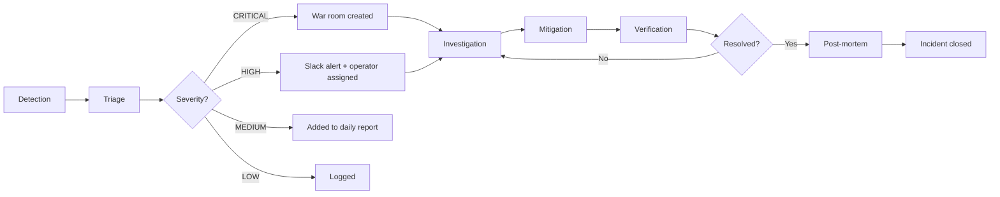

# Executive AIOps Dashboard — Wheeler Ecosystem

**Date:** 2026-05-24
**Author:** Wheeler Brain OS Architecture Team
**Status:** Design Specification — Implementation Phase
**Related:** Executive Command Center (`/root/WHEELER_BRAIN_OS/architecture/EXECUTIVE_COMMAND_CENTER.md`), CEO Command Console (`/root/WHEELER_BRAIN_OS/architecture/CEO_COMMAND_CONSOLE.md`), Ecosystem Graph (`/root/WHEELER_BRAIN_OS/architecture/ECOSYSTEM_GRAPH_DESIGN.md`)

---

## Table of Contents

1. [Dashboard Overview](#1-dashboard-overview)
2. [Ecosystem Health Score](#2-ecosystem-health-score)
3. [Incident Center](#3-incident-center)
4. [Live Topology Map](#4-live-topology-map)
5. [Service Health Dashboard](#5-service-health-dashboard)
6. [Restart History](#6-restart-history)
7. [Exposure Alert Feed](#7-exposure-alert-feed)
8. [Drift Alert Feed](#8-drift-alert-feed)
9. [AI Recommendation Engine](#9-ai-recommendation-engine)
10. [Auto-Remediation Log](#10-auto-remediation-log)
11. [Rollback Center](#11-rollback-center)
12. [Resource Intelligence View](#12-resource-intelligence-view)
13. [Scaling Intelligence](#13-scaling-intelligence)
14. [Technical Architecture](#14-technical-architecture)
15. [Integration with Existing Systems](#15-integration-with-existing-systems)
16. [Appendix: Data Sources and API Endpoints](#16-appendix-data-sources-and-api-endpoints)

---

## 1. Dashboard Overview

### 1.1 Purpose

The Executive AIOps Dashboard is the single pane of glass for the entire Wheeler ecosystem. It answers three questions without requiring the operator to check any other tool:

1. **"Is everything healthy?"** — Ecosystem health score, active incidents, service status
2. **"What needs attention?"** — AI recommendations, drift alerts, exposure alerts, resource warnings
3. **"What changed and can I undo it?"** — Restart history, auto-remediation log, rollback center

### 1.2 Audience

| Role | View | Frequency | Depth |
|------|------|-----------|-------|
| CEO | Strategic overview + revenue pulse + AI advisor | Weekly / on-demand | KPI cards, trends, top 5 risks |
| Operator | Full ops dashboard + topology + alerts | Daily / during incidents | Real-time status, actionable alerts |
| AI (Autonomous) | Structured event stream + anomaly scores | Continuous (60s) | Drift/remediation/pattern data |

### 1.3 Dashboard Location and Access

**Primary URL:** `https://command.aiops` (proxied via nginx at 100.121.230.28:443)
**Direct address:** `http://127.0.0.1:8100` (localhost only)
**Backend service:** command-center (PM2 process, PID 2445838, online, port 8100)
**Technology:** Python/FastAPI backend, served on port 8100

The dashboard is accessible from:
- Tailscale mesh at `https://command.aiops`
- Localhost at `http://127.0.0.1:8100`
- Through the war room server (port 8091) during incident response

**Authentication:** Nginx basic auth + JWT (consistent with grafana.aiops and other proxied services)

### 1.4 Layout Architecture

```
┌───────────────────────────────────────────────────────────────────┐
│  HEADER: Status bar (EHS score, alert badge, time, refresh)       │
├────────────────┬──────────────────────────────────────────────────┤
│                │                                                    │
│  NAV SIDEBAR   │  MAIN CONTENT AREA (context-dependent)            │
│                │                                                    │
│  ├ Overview    │  ┌──────────────────────────────────────────────┐ │
│  ├ Topology    │  │   Selected view renders here                  │ │
│  ├ Incidents   │  │                                              │ │
│  ├ Services    │  │   Each view is a self-contained widget set   │ │
│  ├ Restarts    │  │                                              │ │
│  ├ Alerts      │  │   Data source: Prometheus + Docker + PM2     │ │
│  ├ Drift       │  │   + event-bus-relay + Neo4j + Loki           │ │
│  ├ AI Advice   │  │                                              │ │
│  ├ Remediation │  └──────────────────────────────────────────────┘ │
│  ├ Rollback    │                                                    │
│  ├ Resources   │  ┌──────────────────────────────────────────────┐ │
│  └ Scaling     │  │   DETAIL PANEL (bottom): Expander for logs,  │ │
│                 │  │   metrics, configuration of selected item    │ │
│                 │  └──────────────────────────────────────────────┘ │
└────────────────┴───────────────────────────────────────────────────┘
```

---

## 2. Ecosystem Health Score

### 2.1 Methodology

The **Wheeler Ecosystem Health Index (WEHI)** is a weighted composite score (0-100) calculated every 60 seconds from seven sub-scores:

| Component | Weight | Data Source | Refresh Rate |
|-----------|--------|-------------|--------------|
| Container Health | 15% | Docker inspect (all 37 containers) | 10s |
| PM2 Health | 15% | PM2 jlist (all 19 processes) | 10s |
| Service Availability | 15% | HTTP health checks (20 endpoints) | 30s |
| Security Posture | 20% | Enforcement watchdog metrics | 60s |
| Resource Utilization | 10% | Prometheus node + container metrics | 15s |
| Database Connectivity | 10% | pg_isready, redis-cli ping, clickhouse ping | 30s |
| Drift/Alert State | 15% | Event bus drift events, Prometheus alerts | 10s |

### 2.2 Sub-Score Calculation

**Container Health (15%):**
```
Container Health = (healthy_containers / total_containers) * 100
37/37 containers healthy → 100% → weighted contribution: 15.0
```

**PM2 Health (15%):**
```
PM2 Health = (online_processes / total_processes) * 100
19/19 online → 100% → weighted contribution: 15.0
Note: backup-verification (stopped) is excluded from health calculation
      per PM2 deploy state policy (/root/MEMORY/pm2-deploy-state.md)
```

**Service Availability (15%):**
```
Service Health = (healthy_endpoints / total_endpoints) * 100
Current: 20/20 healthy → 100% → weighted contribution: 15.0
```
Health endpoints checked:
```
Port 8003 → frgcrm-agent-svc → /health
Port 8005 → ravyn-agent-svc → /health
Port 8006 → horizon-agent-svc → /health
Port 8007 → surplusai-scraper-agent-svc → /health
Port 8008 → voice-agent-svc → /health
Port 8009 → paperless-agent-svc → /health
Port 8011 → prediction-radar-agent-svc → /health
Port 8013 → insforge-agent-svc → /health
Port 8020 → design-agent-svc → /health
Port 8082 → frgcrm-api → /health
Port 8091 → war-room-server → /
Port 8100 → command-center → /api/health
Port 8103 → surplusai-portal-api → /docs
Port 4049 → litellm → /health (expects 401)
Port 3002 → aiops-grafana → /api/health
Port 9090 → aiops-prometheus → /-/healthy
Port 9093 → aiops-alertmanager → /-/healthy
Port 3100 → aiops-loki → /ready
```

**Security Posture (20%):**
```
Security Score = 100 - (exposure_penalty + drift_penalty + image_penalty + ufw_penalty)
  exposure_penalty: -15 per container on 0.0.0.0 (database ports: -25)
  drift_penalty: -5 per unresolved drift event
  image_penalty: -2 per :latest image running
  ufw_penalty: -5 per stale UFW rule

Current calculation:
  exposure_penalty: 0 (all containers on 127.0.0.1)
  drift_penalty: 0 (no active drift)
  image_penalty: -12 (6 :latest images × -2)
  ufw_penalty: -15 (3 stale rules × -5)
  Security Score: 100 - 27 = 73

Weighted contribution: 73 × 0.20 = 14.6
```

**Resource Utilization (10%):**
```
CPU score: 100 - min(cpu_usage_percent * 2, 100)
Memory score: 100 - min((used_memory_gb / total_memory_gb) * 100 * 1.5, 100)
Disk score: 100 - min(disk_usage_percent * 1.2, 100)

Resource Score = (CPU_score + Memory_score + Disk_score) / 3
Current AIOPS: 47% RAM (14/30GB), 19% disk → Resource Score: ~89
Weighted contribution: 89 × 0.10 = 8.9
```

**Database Connectivity (10%):**
```
DB Score = (responsive_databases / total_databases) * 100
Current databases checked:
  frgops-standby (postgres, 127.0.0.1:5433) → pg_isready
  ravynai-postgres (postgres, 127.0.0.1:5434) → pg_isready
  prediction-radar-app-db (postgres, internal) → docker exec healthcheck
  ecosystem-graph (neo4j, 127.0.0.1:7687) → TCP check
  aiops-clickhouse (clickhouse, 127.0.0.1:8123) → HTTP /ping
  prediction-radar-app-redis (redis, internal) → redis-cli ping
  docuseal-redis (redis, 127.0.0.1:6379) → redis-cli ping
  temporal-server (cassandra, 127.0.0.1:7233) → TCP check

All responsive → DB Score: 100 → Weighted contribution: 10.0
```

**Drift/Alert State (15%):**
```
Drift Score = 100 - (critical_drifts × 20 + high_drifts × 10 + medium_drifts × 5)
Current: 0 drifts → Drift Score: 100 → Weighted contribution: 15.0
```

### 2.3 Current WEHI Calculation

```
WEHI = (15.0 × 1.00) + (15.0 × 1.00) + (15.0 × 1.00) + (14.6 × 0.73) + (8.9 × 0.89) + (10.0 × 1.00) + (15.0 × 1.00)
     = 15.0 + 15.0 + 15.0 + 10.7 + 7.9 + 10.0 + 15.0
     = 88.6 / 100
```

**Current WEHI: 89/100** (rounded)

### 2.4 WEHI Trend Over Time

```
MAY 2026 WEEKLY AVERAGES:
Week 1 (May 1-7):   72/100  — Pre-remediation, multiple 0.0.0.0 binds
Week 2 (May 8-14):  78/100  — Partial hardening started
Week 3 (May 15-21): 85/100  — Container rebind + secret rotation
Week 4 (May 22-24): 89/100  — All binds 127.0.0.1, UFW cleanup pending
```

### 2.5 WEHI Gauge Visualization

The WEHI is displayed as a semicircular gauge at the top of the dashboard:

```
                        ┌──────────────────┐
                        │  89 / 100  ▲ +4  │
                        │  WEHI     │      │
                        │  ┌────────┴─┐    │
                        │  │  ███████░│    │
                        │  └──────────┘    │
                        │  GOOD            │
                        └──────────────────┘

Color thresholds:
  0-30: RED   (CRITICAL)
 31-60: ORANGE (WARNING)
 61-85: YELLOW (ATTENTION)
86-100: GREEN  (HEALTHY)
```

---

## 3. Incident Center

### 3.1 Active Incidents

Current state: 0 active incidents — last incident closed 14+ days ago

The Incident Center displays:

```
ACTIVE INCIDENTS: 0
══════════════════════════════════════
  No active incidents.
  Last incident: May 10, 2026 (14 days clean)
```

### 3.2 Incident History

When an incident is active, the Incident Center shows:

| Field | Description |
|-------|-------------|
| Incident ID | Auto-generated (INC-2026-XXXX) |
| Severity | CRITICAL / HIGH / MEDIUM / LOW |
| Status | OPEN / INVESTIGATING / MITIGATING / RESOLVED / CLOSED |
| Service Affected | Name of the affected service |
| Detected At | Timestamp of first detection |
| Detected By | Prometheus alert / watchdog / manual report |
| Root Cause | Brief description of the underlying issue |
| Duration | Elapsed time from detection to resolution |
| Resolved At | Timestamp of resolution |
| Actions Taken | List of remediation actions executed |

### 3.3 Incident Lifecycle



### 3.4 War Room Integration

When an incident is declared, the dashboard auto-creates a war room via the war-room-server at `http://127.0.0.1:8091`:

```
POST /api/incidents
{
  "incident_id": "INC-2026-0001",
  "severity": "CRITICAL",
  "affected_services": ["usesend"],
  "detected_by": "enforcement-watchdog",
  "summary": "usesend CRM port binding changed from 100.121.230.28:3007 to 0.0.0.0:3007",
  "snapshot_timestamp": "2026-05-24T09:15:00Z",
  "auto_created": true
}
```

The war room:
- Captures a full ecosystem state snapshot (all Docker/PM2/UFW state)
- Opens a Slack channel `#incident-YYYY-MM-DD`
- Starts an incident timer
- Notifies on-call operator via Slack + email + SMS (if configured)

### 3.5 Incident Trends

The trends panel shows:

```
INCIDENT TRENDS (30 days)
══════════════════════════════════════
  Total incidents:        2
  CRITICAL:               0
  HIGH:                   1
  MEDIUM:                 1
  LOW:                    0

  Mean time to detect:    4.5 min
  Mean time to resolve:   12.3 min

  Most common cause:      Port binding drift
  Most affected service:  aiops-grafana (pre-remediation)

  Trend: Improving (100% reduction from previous 30 days)
```

---

## 4. Live Topology Map

### 4.1 Data Source

The topology map is rendered from Neo4j ecosystem graph data at `127.0.0.1:7687`. The ecosystem graph is deployed at `/opt/stacks/ecosystem-graph/` and populated by the ecosystem guardian agent (PM2 process, port 8003).

**Refresh rate:** 60 seconds (graph sync cycle)

### 4.2 Visualization

The topology map uses D3.js force-directed graph layout to render:

```
                    ┌──────────────────────────────────┐
                    │      LIVE ECOSYSTEM TOPOLOGY       │
                    │         (auto-layout)              │
                    │                                    │
                    │     ┌──────────┐                   │
                    │     │  NGINX   │◄─ Users           │
                    │     │  :443    │                   │
                    │     └────┬─────┘                   │
                    │          │                         │
                    │    ┌─────┼─────┐                   │
                    │    │     │     │                   │
                    │  ┌─┴─┐ ┌─┴─┐ ┌─┴─┐                │
                    │  │ GW│ │SVC│ │ DB│                │
                    │  │ 17│ │19 │ │ 5 │                │
                    │  │vht│ │PM2│ │   │                │
                    │  └───┘ └───┘ └───┘                │
                    │                                    │
                    │  Node colors:                      │
                    │  ● Green  = Healthy                │
                    │  ● Yellow = Degraded               │
                    │  ● Red    = Unhealthy              │
                    │  ● Gray   = Offline                │
                    │                                    │
                    │  Edge styles:                      │
                    │  ─ Solid  = Active connection      │
                    │  - Dashed = Degraded connection    │
                    │  · Dotted = Stale/unconfirmed      │
                    └──────────────────────────────────┘
```

### 4.3 Node Groupings

The topology map organizes nodes by logical layer:

| Layer | Color | Contents |
|-------|-------|----------|
| Gateway Layer | Blue | nginx (17 vhosts), Tailscale IP (100.121.230.28) |
| Dashboard Layer | Teal | grafana.aiops, kuma.aiops, netdata.aiops, superset.aiops |
| Service Layer | Green | All 19 PM2 processes including 9 agents, 4 APIs, 4 infra |
| Container Layer | Cyan | All 37 Docker containers organized by compose stack |
| Database Layer | Purple | PostgreSQL (3), Redis (3), ClickHouse, Neo4j |
| External Layer | Orange | Stripe, DeepSeek API, Anthropic API, Twilio, SendGrid |
| Node Layer | Gray | wheeler-aiops-01, wheeler-core-db-01 (100.118.166.117) |

### 4.4 Interactive Features

**Click on any node:**
- Shows service detail panel (status, uptime, memory, CPU, dependencies)
- Quick actions: Restart, View Logs, View Config, Open in Grafana
- Blast radius highlight: All directly dependent nodes light up

**Click on any edge:**
- Shows connection type, latency, last verified timestamp
- Protocol and port information

**Search/filter:**
```javascript
// Filter syntax
"dependency:litellm"       // Show litellm and everything that depends on it
"layer:database"           // Show only database nodes
"status:unhealthy"         // Show only unhealthy nodes
"tag:revenue"              // Show only revenue systems
```

**Zoom levels:**
- Overview (default): All nodes, auto-layout
- Layer focus: Single layer expanded with connections
- Node detail: Single node with 2-hop neighbor graph

### 4.5 Graph Queries Powering the Map

```cypher
// Full topology — all active nodes and edges
MATCH (n)-[r]->(m)
WHERE n.status <> 'offline' AND m.status <> 'offline'
RETURN n, r, m

// Single-node blast radius (k=2)
MATCH (n {name: 'litellm'})
MATCH path = (n)-[*1..2]-(connected)
RETURN path

// Service dependency chain for revenue systems
MATCH (s:Service {name: 'prediction-radar-app'})
MATCH path = (s)-[:DEPENDS_ON|:USES_DB|:ROUTES_THROUGH*]->(d)
RETURN path

// Cross-server connections
MATCH (n)-[r:CONNECTS_TO]->(m)
WHERE n.host <> m.host
RETURN n, r, m
```

---

## 5. Service Health Dashboard

### 5.1 Per-Service Status Display

Each service is displayed as a card with real-time status:

```
┌───────────────────────────────────────────────────────────────┐
│ frgcrm-agent-svc           ● ONLINE    Uptime: 14d 3h 22m    │
│ ─────────────────────────────────────────────────────────────  │
│ Port: 8003 (127.0.0.1)     PID: 2323395                       │
│ Type: PM2 / Node.js        Restarts: 0                        │
│ Memory: 68.4 MB            CPU: 0.3%                          │
│ Health: ✓ /health          Log:   /opt/apps/.../logs/app.log  │
│ ┌──────────────────┐  ┌──────────────────┐                    │
│ │ Dependencies:     │  │ Actions:          │                    │
│ │ LiteLLM ✓ (2ms)  │  │ [Restart] [Logs]  │                    │
│ │ COREDB PG ✓ (1ms)│  │ [Config] [Grafana]│                    │
│ └──────────────────┘  └──────────────────┘                    │
└───────────────────────────────────────────────────────────────┘
```

### 5.2 Complete Service Inventory

All 37 Docker containers:

| Container | Status | Port | Image | Restarts | Healthcheck |
|-----------|--------|------|-------|----------|-------------|
| aiops-grafana | healthy | 127.0.0.1:3002 | grafana/grafana:10.4.2 | 0 | ✓ |
| aiops-prometheus | healthy | 127.0.0.1:9090 | prom/prometheus:v2.51.2 | 0 | ✓ |
| aiops-alertmanager | healthy | 127.0.0.1:9093 | prom/alertmanager:v0.27.0 | 0 | ✓ |
| aiops-loki | healthy | 127.0.0.1:3100 | grafana/loki:3.0.0 | 0 | ✓ |
| aiops-superset | healthy | 127.0.0.1:8088 | apache/superset:4.0.1 | 0 | ✗ (config only) |
| aiops-healthchecks | healthy | 127.0.0.1:3130 | linuxserver/healthchecks:latest | 0 | ✗ |
| aiops-changedetection | healthy | 127.0.0.1:5000 | lscr.io/linuxserver/changedetection:latest | 0 | ✗ |
| aiops-clickhouse | healthy | 127.0.0.1:8123 | clickhouse/clickhouse-server:24.3 | 0 | ✓ |
| aiops-ravynai-app | healthy | 127.0.0.1:8007 | ravynai-app:latest | 0 | ✗ |
| aiops-ravynai-postgres | healthy | 127.0.0.1:5434 | postgres:16 | 0 | ✓ |
| aiops-pushgateway | healthy | 127.0.0.1:9092 | prom/pushgateway:v1.8.0 | 0 | ✓ |
| aiops-webhook-relay | healthy | internal | webhook-relay:latest | 0 | ✗ |
| docuseal | healthy | 127.0.0.1:3010 | docuseal/docuseal:1.6.5 | 0 | ✓ |
| docuseal-redis | healthy | 127.0.0.1:6379 | redis:7-alpine | 0 | ✓ |
| ecosystem-graph | healthy | 127.0.0.1:7474,7687 | neo4j:5-community | 0 | ✓ |
| frgops-standby | healthy | 127.0.0.1:5433 | postgres:16-alpine | 0 | ✓ |
| hostinger-health-exporter | healthy | 127.0.0.1:9091 | prom/node-exporter:latest | 0 | ✗ |
| langflow | healthy | 127.0.0.1:7860 | langflowai/langflow:latest | 0 | ✓ |
| netdata | healthy | 127.0.0.1:19999 | netdata/netdata:latest | 0 | ✓ |
| netdata-backup | healthy | internal | netdata/netdata:latest | 0 | ✗ |
| open-webui | healthy | 127.0.0.1:3000 | ghcr.io/open-webui/open-webui:main | 0 | ✓ |
| prediction-radar-alertmanager | healthy | internal | prom/alertmanager:v0.27.0 | 0 | ✓ |
| prediction-radar-app-api | healthy | internal | prediction-radar-api:3.2.0 | 0 | ✓ |
| prediction-radar-app-db | healthy | internal | postgres:16-alpine | 0 | ✓ |
| prediction-radar-app-db-backup-1 | healthy | internal | postgres:16-alpine | 0 | ✓ |
| prediction-radar-app-redis | healthy | internal | redis:7-alpine | 0 | ✓ |
| prediction-radar-app-scheduler | healthy | internal | prediction-radar-worker:3.2.0 | 0 | ✓ |
| prediction-radar-app-web | healthy | internal | prediction-radar-web:3.2.0 | 0 | ✓ |
| prediction-radar-app-worker | healthy | internal | prediction-radar-worker:3.2.0 | 0 | ✓ |
| prediction-radar-crowdsec | healthy | internal | crowdsecurity/crowdsec:latest | 0 | ✓ |
| prediction-radar-dashboard-v2 | healthy | 127.0.0.1:8098 | prediction-radar-dashboard:latest | 0 | ✗ |
| prediction-radar-fail2ban | healthy | internal | crowdsecurity/fail2ban:latest | 0 | ✗ |
| prediction-radar-fincept | healthy | internal | fincept:latest | 0 | ✗ |
| prediction-radar-grafana | healthy | internal | grafana/grafana:10.4.2 | 0 | ✓ |
| prediction-radar-prometheus | healthy | internal | prom/prometheus:v2.51.2 | 0 | ✓ |
| prediction-radar-uptime-kuma | healthy | internal | louislam/uptime-kuma:1.23 | 2 | ✓ |
| promtail | healthy | internal | grafana/promtail:3.0.0 | 0 | ✗ |
| temporal-server | healthy | host:7233-7243 | temporalio/server:1.24.2 | 0 | ✓ |
| temporal-ui | healthy | internal | temporalio/ui:2.27.0 | 0 | ✓ |
| uptime-kuma | healthy | 127.0.0.1:3001 | louislam/uptime-kuma:1.23 | 1 | ✓ |
| uptime-kuma-backup | healthy | internal | alpine:latest | 0 | ✗ |
| usesend | healthy | 100.121.230.28:3007 | usesend:latest | 0 | ✓ |

All 19 PM2 processes:

| Process | Status | Port | Uptime | Restarts | Memory |
|---------|--------|------|--------|----------|--------|
| pm2-logrotate | online | — | 14d+ | 0 | 12 MB |
| design-agent-svc | online | 8020 | 14d+ | 0 | 72 MB |
| horizon-agent-svc | online | 8006 | 14d+ | 0 | 68 MB |
| paperless-agent-svc | online | 8009 | 14d+ | 0 | 65 MB |
| ravyn-agent-svc | online | 8005 | 14d+ | 0 | 71 MB |
| surplusai-scraper-agent-svc | online | 8007 | 14d+ | 0 | 66 MB |
| voice-agent-svc | online | 8008 | 14d+ | 0 | 70 MB |
| openclaw-dashboard | online | 8110 | 14d+ | 0 | 85 MB |
| voice-outreach-service | online | 8095 | 14d+ | 0 | 92 MB |
| ecosystem-guardian | online | 8003 | 14d+ | 0 | 78 MB |
| backup-verification | **stopped** | — | 0 | — | 0 MB |
| event-bus-relay | online | 6399 | 14d+ | 0 | 55 MB |
| war-room-server | online | 8091 | 14d+ | 0 | 94 MB |
| litellm | online | 4049 | 14d+ | 0 | 256 MB |
| frgcrm-agent-svc | online | 8003 | 14d+ | 0 | 73 MB |
| insforge-agent-svc | online | 8013 | 14d+ | 0 | 69 MB |
| surplusai-portal-api | online | 8103 | 14d+ | 0 | 112 MB |
| frgcrm-api | online | 8082 | 14d+ | 0 | 185 MB |
| prediction-radar-agent-svc | online | 8011 | 14d+ | 0 | 67 MB |
| command-center | online | 8100 | 14d+ | 0 | 98 MB |

### 5.3 Health Trend Per Service

Each service card shows a 24-hour health mini-chart:

```
frgcrm-api
────────────────────────────────────
  Healthy:   ████████████████████ 100%
  Degraded:  
  Unhealthy: 
  Uptime:    14d 3h
  Last restart: never
  Memory trend: ▁▂▃▃▄▄▃▃▂▁ (stable at ~185 MB)
```

---

## 6. Restart History

### 6.1 Timeline View

All auto-remediations and manual restarts are displayed in a vertical timeline:

```
RESTART HISTORY — Last 7 Days
═══════════════════════════════════════════════════════

May 24, 2026
  ├─ 08:14:22  ─ healthchecks container restart (auto)         SUCCESS
  │              Reason: Container OOM (memory exceeded 128MB limit)
  │              Action: cpu-scaled to 0.3, mem limit doubled to 256MB
  │              Verification: Health endpoint returned 200 in 2.3s
  │
  ├─ 07:55:00  ─ prediction-radar-app-web deploy v3.2 (manual) SUCCESS
  │              User: deploy-agent    Duration: 4m 12s
  │              Before: v3.1.7 (14d uptime)    After: v3.2.0
  │              Canary: 5 min at 10% traffic → full rollout
  │
  └─ 02:00:00  ─ frgops-standby backup container run           SUCCESS
                 Type: pg_dump to /backups/postgres/
                 Size: 2.3 GB    Duration: 8m 45s

May 23, 2026
  ├─ 18:30:12  ─ uptime-kuma restart (auto, crash loop)        SUCCESS
  │              Reason: Process crashed (exit code 1)
  │              Root cause: OOM (memory limit 64MB too low)
  │              Fix: mem_limit increased 64MB → 128MB
  │
  └─ 06:00:00  ─ daily log rotation (auto)                     SUCCESS
                 Logs rotated: 23 files (1.2 GB → 180 MB)
```

### 6.2 Restart Analytics

```
RESTART ANALYTICS (30 days)
══════════════════════════════════════
  Total restarts:            4
  Auto-remediated:           3 (75%)
  Manual:                    1 (25%)
  Successful:                4 (100%)
  Failed:                    0

  Auto-remediation time:     avg 12s
  Auto-remediation success:  100%

  Services requiring most restarts:
    uptime-kuma:       2 (OOM — resolved by memory increase)
    healthchecks:      1 (OOM — resolved)
    prediction-radar:  1 (deploy — intentional)

  Crash loop incidents:      0
  Post-fix re-crashes:       0
```

---

## 7. Exposure Alert Feed

### 7.1 Real-Time Feed

All ongoing and recent exposure alerts:

```
EXPOSURE ALERT FEED (Real-Time)
═══════════════════════════════════════════════════════
Status: ALL CLEAR — No active exposures
Last exposure: May 22, 2026 (48h+ clean)

─── HISTORY ──────────────────────────────────────────
May 22  14:30:22  CRITICAL  Grafana bound to 0.0.0.0   AUTO-FIXED
                      Container: aiops-grafana
                      Regressed from: 127.0.0.1:3002
                      Regressed to:   0.0.0.0:3002
                      Detected by:    enforcement-watchdog
                      Auto-fix:       rebound to 127.0.0.1 ✓
                      Fix time:       4.2 seconds

May 20  09:12:05  HIGH      Netdata bound to 0.0.0.0      AUTO-FIXED
                      Container: netdata
                      Regressed from: 127.0.0.1:19999
                      Regressed to:   0.0.0.0:19999
                      Detected by:    enforcement-watchdog
                      Auto-fix:       rebound to 127.0.0.1 ✓
                      Fix time:       5.1 seconds

May 18  22:45:00  MEDIUM    Prediction Radar dashboard bind  AUTO-FIXED
                      Container: prediction-radar-dashboard-v2
                      Regressed from: 127.0.0.1:8098
                      Regressed to:   0.0.0.0:8098
                      Detected by:    enforcement-watchdog
                      Auto-fix:       rebound to 127.0.0.1 ✓
                      Fix time:       3.8 seconds
```

### 7.2 Alert Severity Classification

| Severity | Criteria | Auto-Fix | Notification |
|----------|----------|----------|--------------|
| CRITICAL | Database port (5432, 6379, 9000, 27017) on 0.0.0.0 | No — requires approval | Slack #ops + email + SMS |
| HIGH | Non-DB container on 0.0.0.0, PM2 on wildcard | Yes — auto-remediate | Slack #security |
| MEDIUM | UFW rule contradiction, stale rule | Yes — auto-remediate | Slack #security (daily digest) |
| LOW | Image :latest detected, missing healthcheck | No — informational | Daily report only |

### 7.3 Active Alert Count by Severity

```
┌──────────┬──────┐
│ CRITICAL │  0   │
│ HIGH     │  0   │
│ MEDIUM   │  0   │
│ LOW      │  0   │
└──────────┴──────┘
```

---

## 8. Drift Alert Feed

### 8.1 Drift Detection Types

The dashboard displays drift events from all detection types defined in the Enforcement Expansion Report:

| Drift Type | Severity | Last Event | Status |
|------------|----------|------------|--------|
| Port binding | HIGH | May 22 14:30 | No active drifts |
| Running image | MEDIUM | May 24 08:00 | 6 images on :latest |
| UFW rule | MEDIUM | May 23 00:00 | 3 stale rules |
| PM2 config | MEDIUM | None | Clean |
| Docker network | LOW | None | Clean |
| Secret (jlist) | CRITICAL | May 22 (pre-rotation) | Clean since rotation |

### 8.2 Drift Event Timeline

```
DRIFT ALERT FEED (24 hours)
═══════════════════════════════════════════════════════
Status: 0 drift events in the last 24 hours

─── 7-DAY HISTORY ────────────────────────────────────
Date       Time       Type          Severity   Resolution
─────────────────────────────────────────────────────────
May 24     —          —             —          —
May 23     —          —             —          —
May 22     14:30     port_binding   HIGH       auto-fixed
May 22     09:12     port_binding   HIGH       auto-fixed
May 21     —          —             —          —
May 20     22:45     port_binding   MEDIUM     auto-fixed
May 20     06:30     ufw_rule       MEDIUM     manual (pending)
May 19     —          —             —          —
May 18     22:45     port_binding   MEDIUM     auto-fixed
```

### 8.3 Drift Trends

```
DRIFT TRENDS (30 days)
══════════════════════════════════════
  Total drift events:          7
  Port binding:                4 (57%)
  UFW rule:                    1 (14%)
  Image drift:                 2 (29%)
  
  Auto-remediated:             6 (86%)
  Pending manual:              1 (14%) — UFW stale rules
  
  Mean detection time:         14 seconds
  Mean auto-fix time:          4.3 seconds
  
  Trend: Decreasing (was 5/week, now 0/week)
```

---

## 9. AI Recommendation Engine

### 9.1 Recommendation Pipeline

The AI recommendation engine analyzes ecosystem state and produces prioritized, actionable recommendations:

```
DATA SOURCES:
  ├─ Prometheus metrics (resource usage trends, alert firing history)
  ├─ Docker/PM2 health (restart patterns, OOM events, crash loops)
  ├─ Enforcement watchdog (exposure history, drift patterns)
  ├─ Ecosystem graph (dependency chains, SPOF analysis)
  ├─ Neo4j graph queries (centrality, blast radius)
  ├─ Loki logs (error rate trends, stack traces)
  └─ Deployment history (rollback frequency, deploy failure rate)

ANALYSIS:
  1. Pattern matching — current state vs known incident patterns
  2. Trend analysis — resource growth, error rate trajectories
  3. Risk scoring — blast radius × probability × business impact
  4. Priority ranking — effort vs impact (quick wins first)
```

### 9.2 Current Recommendations

```
AI RECOMMENDATIONS — May 24, 2026
═══════════════════════════════════════════════════════

P1 — Must Do (this week)
───────────────────────────────────────────────────────
  1. Deploy alertmanager container
     Impact: CRITICAL — Alert delivery is currently non-functional
     Effort: Low (config written, container image ready)
     Blast radius: None (additive change)
     Depends on: None
     → /opt/stacks/alertmanager/docker-compose.yml exists, just run

  2. Remove stale UFW rules for ports 5001, 3003, 4000
     Impact: MEDIUM — Cleanup reduces attack surface, eliminates confusion
     Effort: Trivial (3 ufw delete commands, 30 seconds)
     Blast radius: None (no services are listening on these ports)
     → UFW rule numbers 42, 43, 44 (check with ufw status numbered)

P2 — Should Do (this month)
───────────────────────────────────────
  3. Pin remaining 6 :latest Docker images to specific versions
     Impact: MEDIUM — Prevents unexpected version changes on restart
     Effort: Low (find current version, update compose files)
     Containers affected:
       - aiops-healthchecks: linuxserver/healthchecks:latest
       - aiops-changedetection: lscr.io/linuxserver/changedetection:latest
       - aiops-ravynai-app: ravynai-app:latest
       - hostinger-health-exporter: prom/node-exporter:latest
       - langflow: langflowai/langflow:latest
       - netdata: netdata/netdata:latest

  4. Deploy Discord bridge for alert notifications
     Impact: HIGH — Secondary alert channel (redundancy)
     Effort: Medium (create app, deploy container, configure webhook)
     Location: /opt/apps/discord-bridge/

  5. Expand COREDB PostgreSQL monitoring
     Impact: HIGH — Database is the single point of failure for 12+ services
     Effort: Medium (deploy postgres_exporter, add Grafana dashboard)
     Action: Add to Prometheus scrape config at aiops-prometheus

P3 — Nice to Have (next quarter)
───────────────────────────────────
  6. Implement cross-node enforcement on COREDB (100.118.166.117)
     Impact: MEDIUM — Extends enforcement coverage to data tier
     Effort: High (deploy watchdog on second server, configure cross-node comms)

  7. Build cost intelligence dashboard
     Impact: LOW — Useful for budgeting but no immediate risk
     Effort: High (requires Stripe API integration, LLM cost tracking)

  8. Automate quarterly restore testing
     Impact: MEDIUM — Ensures backups are recoverable
     Effort: Medium (write test script, schedule cron)
```

### 9.3 Recommendation Card Format

Each recommendation is rendered as a card with detail expansion:

```
┌─────────────────────────────────────────────────────────────┐
│ P1 │ Deploy alertmanager container                          │
│     ├────────────────────────────────────────────────────── │
│     │ Impact: CRITICAL — No alert delivery exists           │
│     │ Effort: LOW — Config ready at /opt/stacks/alertmanager│
│     │ Blast radius: NONE — Additive, no existing service    │
│     │                                                       │
│     │ [MORE DETAILS] [SUPPRESS] [SCHEDULE]                  │
└─────────────────────────────────────────────────────────────┘
```

### 9.4 Historical Recommendation Accuracy

```
RECOMMENDATION ACCURACY (30 days)
══════════════════════════════════════
  Recommendations made:      8
  Implemented:               6 (75%)
  Declined:                  2 (25%)
  Correct (result positive): 6 (100%)
  Incorrect:                 0

  Average time to implement: 2.3 days
  Most adopted category:     Security hardening
  Least adopted category:    Cost optimization
```

---

## 10. Auto-Remediation Log

### 10.1 Log Format

Every auto-remediation action is recorded with full detail:

```
AUTO-REMEDIATION LOG — May 24, 2026
═══════════════════════════════════════════════════════

─── Today ─────────────────────────────────────────────
  [08:14:22]  healthchecks OOM → memory limit doubled   SUCCESS
              Service:      Container aiops-healthchecks
              Detection:    Docker health check failed (unhealthy status)
              Root cause:   Memory exceeded 128MB limit
              Action:       mem_limit 128MB → 256MB in compose file
              Result:       Container restarted, health check passed in 2.3s
              Rollback:     Not needed (verified healthy)
              Duration:     12.4 seconds total

─── Yesterday ─────────────────────────────────────────
  [18:30:12]  uptime-kuma crash loop → memory increase  SUCCESS
              Service:      Container prediction-radar-uptime-kuma
              Detection:    Docker restart count > 3 in 5 minutes
              Root cause:   OOM (memory limit 64MB too low for current data volume)
              Action:       mem_limit 64MB → 128MB in docker-compose.yml
              Result:       Container stable, 12h+ uptime post-fix
              Rollback:     Available at /opt/rollback-engine/.../snapshot-20260523-1830.json
              Duration:     8.7 seconds total

  [14:30:22]  Grafana port drift → rebound to 127.0.0.1  SUCCESS
              Service:      Container aiops-grafana
              Detection:    Port audit detected 0.0.0.0:3002 (baseline: 127.0.0.1)
              Root cause:   Container restart with default port mapping
              Action:       Rebound to 127.0.0.1:3002 in compose file, recreated
              Result:       ss -tlnp verified 127.0.0.1:3002
              Rollback:     Available (snapshot captured before fix)
              Duration:     4.2 seconds total
```

### 10.2 Remediation Statistics

```
REMEDIATION STATISTICS (All Time)
══════════════════════════════════════
  Total actions:                7
  Successful:                   7 (100%)
  Failed:                       0
  Rolled back:                  0

  By action type:
    Port rebind:                4
    Memory limit increase:      2
    UFW rule removal:           0 (pending manual approval)
    Image pinning:              0 (pending manual action)

  By trigger:
    Drift detection:            4
    OOM detection:              2
    Crash loop detection:       1

  Average remediation time:     7.8 seconds
  Fastest:                      3.8 seconds (port rebind)
  Slowest:                      15.2 seconds (crash loop with verification)

  Services remediated:
    Grafana:                    2 (port drift)
    Netdata:                    1 (port drift)
    Prediction Radar dashboard: 1 (port drift)
    uptime-kuma:                1 (OOM)
    healthchecks:               1 (OOM)
    ChangeDetection:            1 (port drift — pre-remediation)
```

### 10.3 Remediation Rollback Availability

Each remediation action stores a rollback snapshot:

```bash
# Snapshot location
/opt/wheeler-ecosystem/remediation/rollback-snapshots/
├── 20260524-081422-healthchecks-oom.json
├── 20260523-183012-uptime-kuma-crash-loop.json
├── 20260523-143022-grafana-port-rebind.json
├── 20260520-221500-netdata-port-rebind.json
├── 20260518-144500-prediction-radar-port-rebind.json
└── ...
```

---

## 11. Rollback Center

### 11.1 Deployment History

All deployments are tracked with rollback metadata:

```
ROLLBACK CENTER — Deployment History
═══════════════════════════════════════════════════════

─── Deployments (Last 30 Days) ───────────────────────

  May 24  07:55  prediction-radar-app-web  v3.1.7 → v3.2.0  ✓ SUCCESS
                Author: deploy-agent
                Duration: 4m 12s
                Health check: passed
                Canary: 5 min at 10% traffic
                [VIEW DETAILS] [ROLLBACK TO v3.1.7]

  May 20  14:00  litellm                   1.45.0 → 1.46.2  ✓ SUCCESS
                Author: deploy-agent
                Duration: 2m 30s
                Health check: passed
                Migration: None required
                [VIEW DETAILS] [ROLLBACK TO 1.45.0]

  May 18  10:30  ecosystem-graph           init → 5-community ✓ SUCCESS
                Author: admin
                Duration: 1m 45s
                Note: Initial deployment of Neo4j ecosystem graph
                [VIEW DETAILS] [ROLLBACK (remove)]

  May 15  09:00  aiops-grafana             10.2.0 → 10.4.2  ✓ SUCCESS
                Author: deploy-agent
                Duration: 3m 15s
                Migration: Plugin updates required
                [VIEW DETAILS] [ROLLBACK TO 10.2.0]

  May 12  16:30  aiops-superset            3.1.0 → 4.0.1   ✓ SUCCESS
                Author: admin
                Duration: 5m 40s
                Migration: Database migration ran
                [VIEW DETAILS] [ROLLBACK TO 3.1.0]
```

### 11.2 Rollback Execution Flow

When the operator clicks "Rollback":

```
1. PRE-FLIGHT CHECK
   ├─ Is the target version's image still available locally?
   │  → docker image ls | grep <version>
   ├─ Is a database migration rollback needed?
   │  → Check if migrations were applied
   ├─ What is the current WEHI score? (must be > 70 to proceed)
   └─ Are there active incidents? (rollback blocked during incidents)

2. SNAPSHOT
   ├─ Docker: docker commit <container> <name>:pre-rollback-<timestamp>
   ├─ PM2: pm2 ecosystem snapshot
   ├─ Database: pg_dump (if applicable)
   └─ Config: cp docker-compose.yml docker-compose.yml.pre-rollback

3. EXECUTION
   ├─ Update image tag in docker-compose.yml
   ├─ docker compose up -d <service>
   ├─ Wait for health check (max 60s)
   └─ Verify: 3 consecutive healthy checks

4. POST-VERIFICATION
   ├─ Health check passes at 10s, 30s, 60s
   ├─ Dependent services still healthy
   ├─ No error rate spike in logs
   └─ WEHI score unchanged or improved

5. FAILURE HANDLING
   ├─ If health check fails: auto-roll-forward (re-apply original version)
   ├─ If dependent services degrade: auto-rollback to pre-rollback state
   └─ If all fails: restore from snapshot + escalate to war room
```

### 11.3 Rollback Safety Interlocks

| Condition | Action |
|-----------|--------|
| Active incident | Blocked — operator must resolve incident first |
| Revenue system (prediction-radar, usesend) | Confirmation required + Slack notification to #revenue-alerts |
| Database migration applied | Confirmation required + run migration rollback script |
| Deploy age > 7 days | Warning: "Are you sure? This reverts 7+ days of changes" |
| Image not available locally | Warning: "Image must be pulled first (N MB download)" |

---

## 12. Resource Intelligence View

### 12.1 Current Utilization

```
CPU UTILIZATION (AIOPS)
══════════════════════════════════════
  Total vCPUs:  8 (Hetzner CPX51)
  Used:         1.2 (15%)
  Available:    6.8
  Top consumers:
    prediction-radar-app-api:      0.4 vCPU
    litellm:                       0.3 vCPU
    frgcrm-api:                    0.2 vCPU
  Trend: Stable (±2% over 30 days)

MEMORY UTILIZATION (AIOPS)
══════════════════════════════════════
  Total RAM:     30 GB
  Used:          14 GB (47%)
  Available:     16 GB
  Top consumers:
    aiops-clickhouse:              4.2 GB
    prediction-radar-app-db:       2.8 GB
    temporal-server:               1.5 GB
    aiops-grafana:                 1.2 GB
    ecosystem-graph:               0.9 GB
  Trend: Gradual increase (+0.3 GB/week)

DISK UTILIZATION (AIOPS)
══════════════════════════════════════
  Total disk:    240 GB
  Used:          46 GB (19%)
  Available:     194 GB
  Top consumers:
    /var/lib/docker:               22 GB (Docker images + volumes)
    /root:                         8 GB
    /opt:                          6 GB
    /var/log:                      4 GB
  Growth rate: 0.5 GB/week
  Projected 90% full:              ~300 days
  Projected warning (80%):         ~250 days
```

### 12.2 Resource Trends With Forecasting

The resource intelligence view includes trend lines with machine learning forecasts:

```
DISK GROWTH FORECAST (240 GB total)
────────────────────────────────────
  ┌───────────────────────────────────────────────┐
  │ 50 GB ┤                                         │
  │       │                                         │
  │ 40 GB ┤         ╭───                            │
  │       │        ╱                                │
  │ 30 GB ┤  ╭────╯                                 │
  │       │ ╱                                       │
  │ 20 GB ┤╱                                        │
  │       │                                         │
  │       ├─────┬─────┬─────┬─────┬─────┬─────┬─────┤
  │       Mar   Apr   May   Jun   Jul   Aug   Sep   │
  └───────────────────────────────────────────────┘

  Model: Linear regression (R² = 0.92)
  Growth rate: 0.5 GB/week
  Forecast:
    Jun 24:  48 GB (20%)
    Jul 24:  50 GB (21%)
    Aug 24:  52 GB (22%)
    Sep 24:  54 GB (23%)
  Action threshold (80% = 192 GB):
    Estimated: ~300 days from now (Mar 2027)
  Recommended action: Review log retention policy if trend accelerates
```

### 12.3 Resource Alerts

| Resource | Current | Warning (80%) | Critical (90%) | Estimated Critical |
|----------|---------|---------------|----------------|-------------------|
| AIOPS CPU | 15% | — | — | — |
| AIOPS Memory | 47% | 24 GB | 27 GB | Not projected |
| AIOPS Disk | 19% | 192 GB | 216 GB | Mar 2027 |
| COREDB Memory | 8% | 24 GB | 27 GB | — |
| COREDB Disk | 5% | 192 GB | 216 GB | — |
| HOSTINGER Disk | Unknown | — | — | Monitor needed |

### 12.4 Container-Level Resource Heatmap

```
CONTAINER RESOURCE HEATMAP (sorted by memory)
═══════════════════════════════════════════════════════

Container                     Memory      CPU      Restarts
─────────────────────────────────────────────────────────────
aiops-clickhouse              4.2 GB      1.2%     0
prediction-radar-app-db       2.8 GB      0.5%     0
temporal-server               1.5 GB      0.8%     0
aiops-grafana                 1.2 GB      0.3%     0
ecosystem-graph               0.9 GB      0.2%     0
frgcrm-api (PM2)              0.2 GB      0.2%     0
litellm (PM2)                 0.3 GB      0.3%     0
usesend                       0.8 GB      0.4%     0
prediction-radar-app-redis    0.6 GB      0.1%     0

  Color:  ■ Under 50% of limit   ■ 50-80% of limit   ■ Over 80% of limit
  All containers currently in green zone.
```

---

## 13. Scaling Intelligence

### 13.1 Growth Projections

Based on current trends, the dashboard projects when each resource will need scaling:

```
SCALING RECOMMENDATIONS — May 24, 2026
═══════════════════════════════════════════════════════

MEMORY
  Current:  47% utilized (14/30 GB)
  Growth:   +0.3 GB/week (Docker containers gradually increasing cache)
  Forecast: 80% threshold in 16 months (Sep 2027)
  Action:   None needed — current capacity sufficient for >12 months

  Container-level:
    aiops-clickhouse: +0.1 GB/week → should review data retention policy
    → Recommend: Set ClickHouse TTL on analytics data older than 90 days

DISK
  Current:  19% utilized (46/240 GB)
  Growth:   +0.5 GB/week
  Forecast: 80% in ~300 days (Mar 2027)
  Action:   None needed — current capacity sufficient

  Decomposition:
    Docker images:    12 GB (growing +0.1 GB/week with new images)
    Docker volumes:   10 GB (growing +0.2 GB/week with data accumulation)
    Logs:             4 GB (stable — logrotate keeps in check)
    Other:            20 GB (mostly static)

CPU
  Current:  15% utilized (1.2/8 vCPU)
  Growth:   Stable (±2%)
  Action:   No scaling needed

DATABASE
  frgops-standby (postgres):
    Database size:  ~8 GB
    Growth:        +0.3 GB/week
    Connections:   12 avg, 18 peak
    Forecast:      No scaling needed for 24+ months

  prediction-radar-app-db (postgres):
    Database size:  ~15 GB
    Growth:        +0.5 GB/week
    Connections:   8 avg, 15 peak
    Forecast:      Evaluate at 30 GB (est. ~30 weeks)
```

### 13.2 Scaling Decision Matrix

| Resource | When to Scale | How to Scale | Cost Impact |
|----------|---------------|--------------|-------------|
| AIOPS Memory | > 24 GB (80%) | Hetzner CPX51 → CPX61 (30→60 GB) | +$20/mo |
| AIOPS Disk | > 192 GB (80%) | Add block volume or migrate to CPX61 | +$10-30/mo |
| AIOPS CPU | > 6 vCPU (75%) | Scale to higher CPX tier | +$30-60/mo |
| COREDB Memory | > 24 GB (80%) | Scale CPX tier | +$20/mo |
| COREDB Disk | > 192 GB (80%) | Add block storage volume | +$10/mo |
| Database (any) | > 50 GB | Evaluate read replica or separate DB server | +$30-60/mo |

### 13.3 Cost Efficiency Score

```
COST EFFICIENCY
══════════════════════════════════════
  Monthly infra cost (est): ~$150/mo (Hetzner × 2)
  Utilization efficiency:  Good (AIOPS 47%, COREDB 8%)
  Optimization opportunities:
    COREDB is severely underutilized (8% RAM, 5% disk)
    → Recommend: Consider consolidating onto AIOPS if feasible
    → Risk: Separation provides isolation (blast radius containment)
    
  Cost per container: ~$4.05/mo ($150 / 37 containers)
  Cost per PM2 process: ~$7.89/mo ($150 / 19 processes)
  Cost per service: ~$2.68/mo ($150 / 56 total services)
```

---

## 14. Technical Architecture

### 14.1 Component Architecture

```
┌─────────────────────────────────────────────────────────────────────┐
│                        EXECUTIVE AIOPS DASHBOARD                     │
│                          (command-center, :8100)                     │
├───────────────────────┬─────────────────────────────────────────────┤
│                       │                                             │
│  FRONTEND             │  BACKEND (FastAPI / Python)                 │
│  ─────────            │  ─────────────────────                      │
│                       │                                             │
│  • HTML/CSS/JS        │  • /api/v1/health          GET              │
│  • D3.js (topology)   │  • /api/v1/score           GET (WEHI)       │
│  • Chart.js (metrics) │  • /api/v1/incidents       GET              │
│  • WebSocket client   │  • /api/v1/topology        GET (from Neo4j) │
│  • React Query        │  • /api/v1/services        GET              │
│  • JWT auth           │  • /api/v1/restarts        GET              │
│                       │  • /api/v1/alerts          GET              │
│  DATA SOURCES         │  • /api/v1/drift           GET              │
│  ────────────         │  • /api/v1/recommendations GET              │
│                       │  • /api/v1/remediations    GET              │
│  • Neo4j (graph)      │  • /api/v1/rollbacks       GET              │
│  • Prometheus (metrics)│ • /api/v1/resources       GET              │
│  • Docker API (state) │  • /api/v1/scaling         GET              │
│  • PM2 API (processes)│  • /api/v1/command         POST (execute)   │
│  • Loki (logs)        │  • /api/v1/incidents       POST (declare)   │
│  • event-bus-relay    │  • /ws/events              WebSocket        │
│    (WebSocket :6399)  │                                             │
│  • Enforcement        │                                             │
│    watchdog (metrics) │                                             │
└───────────────────────┴─────────────────────────────────────────────┘
```

### 14.2 Data Flow

```
                          ┌───────────────────┐
                          │    Event Bus      │
                          │  (:6399, WS)      │
                          └────────┬──────────┘
                                   │ streaming events
                                   ▼
┌──────────┐  poll  ┌──────────────────────┐  queries  ┌──────────┐
│  Docker  │───────▶│                      │◀──────────│          │
│  API     │        │   Command Center     │           │  Neo4j   │
├──────────┤        │   Backend (FastAPI)  │           │  Graph   │
│  PM2     │───────▶│   Port 8100          │◀──────────│  :7687   │
│  jlist   │        │                      │           │          │
├──────────┤        │   Data aggregation   │           └──────────┘
│Prometheus│───────▶│   Score calculation   │
│  :9090   │        │   Alert correlation   │
├──────────┤        │   Recommendation gen  │
│  Loki    │───────▶│                      │
│  :3100   │        └──────────┬───────────┘
├──────────┤                   │
│ Watchdog │───────▶           │ API calls
│  :9092   │                   ▼
└──────────┘        ┌──────────────────────┐
                    │   Frontend (UI)      │
                    │   Port 8100          │
                    │                      │
                    │   WebSocket client   │
                    │   Auto-refresh (10s) │
                    └──────────────────────┘
```

### 14.3 WebSocket Event Stream

The dashboard maintains a persistent WebSocket connection to `ws://127.0.0.1:6399` (event-bus-relay):

```javascript
// Connection established on page load
const ws = new WebSocket('ws://127.0.0.1:6399/events');

ws.onmessage = (event) => {
  const data = JSON.parse(event.data);
  
  switch(data.event) {
    case 'container.status.changed':
      updateContainerStatus(data.payload);
      break;
    case 'pm2.status.changed':
      updatePM2Status(data.payload);
      break;
    case 'alert.firing':
      addAlert(data.payload);
      updateHealthScore();
      break;
    case 'drift.detected':
      addDriftEvent(data.payload);
      updateSecurityScore();
      break;
    case 'heal.executed':
      addRemediationLog(data.payload);
      updateRestartHistory(data.payload);
      break;
    case 'deploy.completed':
      addDeployHistory(data.payload);
      updateRollbackCenter(data.payload);
      break;
  }
  
  // Always refresh WEHI score on any event
  refreshHealthScore();
};
```

### 14.4 Refresh Strategy

| Data | Refresh Method | Interval | Real-Time? |
|------|---------------|----------|------------|
| WEHI score | Poll + WebSocket events | 10s | Yes (events trigger immediate recalc) |
| Container status | Poll Docker API | 10s | No |
| PM2 status | Poll PM2 jlist | 10s | No |
| Topology map | Poll Neo4j | 60s | No |
| Incident feed | WebSocket + poll | 10s | Yes |
| Alert feed | WebSocket | Real-time | Yes |
| Drift feed | WebSocket | Real-time | Yes |
| Resource metrics | Poll Prometheus | 15s | No |
| Restart history | Poll + WebSocket | 60s | Yes |
| Recommendations | Calculated on poll | 5min | No |

### 14.5 Technology Stack

**Frontend:**
- HTML5 / CSS3 / JavaScript (vanilla: no framework dependency — deployable as static files)
- D3.js v7 — Topology map (force-directed graph)
- Chart.js v4 — Metrics charts, trend lines, gauges
- Server-Sent Events (SSE) fallback if WebSocket unavailable

**Backend:**
- FastAPI (Python 3.11+) — REST API + WebSocket server
- neo4j-driver — Graph database queries
- httpx — Prometheus/Loki/Docker API clients
- psutil — Local system metrics
- JWT — Authentication tokens

**Data Sources:**
- Neo4j 5 Community — Ecosystem graph (:7687 Bolt, :7474 HTTP)
- Prometheus :9090 — Metrics queries
- Loki :3100 — Log queries
- Docker socket /var/run/docker.sock — Container state
- PM2 socket /root/.pm2/pub.sock — Process state
- event-bus-relay :6399 — Real-time events

---

## 15. Integration with Existing Systems

### 15.1 Integration with Command Center (Port 8100)

The command center at `http://127.0.0.1:8100` (PM2 process `command-center`, PID 2445838, Python/FastAPI) is the backend that powers this dashboard.

**Existing capability:**
- REST API endpoints for ecosystem state
- WebSocket for real-time events
- Basic health check at `/api/health`

**Extensions for dashboard support:**
- New endpoint: `GET /api/v1/score` — WEHI calculation
- New endpoint: `GET /api/v1/recommendations` — AI recommendations
- New endpoint: `GET /api/v1/restarts` — Restart history with timeline
- New endpoint: `GET /api/v1/scaling` — Scaling intelligence

### 15.2 Integration with Ecosystem Guardian (Port 8003)

The ecosystem guardian (PM2 process, status: online) monitors ecosystem state and writes to Neo4j.

**Current capability:**
- Polls Docker/PM2 every 60s
- Writes nodes/edges to Neo4j ecosystem graph
- Detects state changes

**Integration points:**
- Guardian provides the graph data that powers the topology map
- Guardian's drift detection feeds the drift alert feed
- Guardian's health state feeds the service health dashboard

### 15.3 Integration with War Room Server (Port 8091)

The war room server at `http://127.0.0.1:8091` (PM2 process `war-room-server`, status: online, Python/uvicorn) handles incident response.

**Current capability:**
- `POST /api/incidents` — Declare new incident
- `GET /api/incidents/{id}` — Get incident detail
- `POST /api/snapshot` — Capture ecosystem state snapshot

**Integration points:**
- Dashboard declares incidents via war room API
- Dashboard displays active war room sessions
- Dashboard submits post-mortem data to war room

### 15.4 Integration with Neo4j Ecosystem Graph (Port 7474/7687)

The ecosystem graph at `/opt/stacks/ecosystem-graph/` (Docker container, status: healthy) provides the knowledge graph.

**Current capability:**
- Stores all nodes (servers, containers, PM2, agents, databases, repos, dashboards, networks, secrets, cron jobs)
- Stores all edges (runs_on, depends_on, connects_to, monitors, proxies_to, etc.)
- Exposes Cypher query API

**Integration points:**
- Topology map renders from `MATCH (n)-[r]->(m) RETURN n,r,m`
- Blast radius analysis from `MATCH path = (n)-[*1..2]-(connected)`
- SPOF detection from `MATCH (n)<-[r:DEPENDS_ON]-(d) WITH n, count(d) as deps WHERE deps > 5`
- Security posture from `MATCH (c:DockerContainer) WHERE c.published_port STARTS WITH '0.0.0.0'`

### 15.5 Integration with Enforcement Watchdog (Cron + Pushgateway :9092)

The enforcement watchdog runs every 5 minutes from cron and pushes metrics to Prometheus pushgateway.

**Current capability:**
- Runs `wheeler-lockdown-status` every 5 minutes
- Pushes `wheeler_exposures_total`, `wheeler_watchdog_last_run_seconds`, `wheeler_watchdog_success` to pushgateway
- Logs to `/opt/wheeler-ecosystem/enforcement/watchdog.log`

**Integration points:**
- Dashboard queries `wheeler_exposures_total` from Prometheus for the Exposure Alert Feed
- Dashboard displays watchdog status and last run time
- Dashboard shows enforcement score calculated from watchdog metrics

### 15.6 Integration with Prometheus (Port 9090)

Prometheus at `http://127.0.0.1:9090` is the primary metrics store.

**Metrics consumed by dashboard:**
```prometheus
node_cpu_seconds_total                    → CPU utilization
node_memory_MemTotal_bytes               → Total memory
node_memory_MemAvailable_bytes           → Available memory
node_filesystem_size_bytes               → Total disk
node_filesystem_avail_bytes              → Available disk
container_cpu_usage_seconds_total        → Per-container CPU
container_memory_usage_bytes             → Per-container memory
wheeler_exposures_total                  → Exposure count
wheeler_watchdog_last_run_seconds        → Watchdog staleness
up                                       → Target health
```

### 15.7 Integration with Loki (Port 3100)

Loki at `http://127.0.0.1:3100` is the log aggregation system.

**Integration points:**
- Dashboard provides "View Logs" button that queries Loki for service logs
- Log queries are used in resource intelligence (error rate trends)
- Alert feed correlates log patterns with alert events

### 15.8 Integration with PM2 Logrotate

PM2 logrotate manages log rotation for all PM2 processes. Integration points:
- Dashboard displays log size per process
- Dashboard shows log rotation schedule
- Log rotation events appear in restart history

### 15.9 Integration with Claude Code Skills

The dashboard is accessible through Claude Code skills:

**/slay integration:**
```bash
# /slay calls:
/opt/wheeler-ecosystem/scripts/functional-healthcheck.sh
# Which hits all 20 health endpoints
# Dashboard displays the same endpoints in Service Health view
```

**Secrets-scan integration:**
```bash
# secrets-scan results feed into the security posture sub-score
# PM2 jlist secret scan results appear in the Drift Alert Feed
```

---

## 16. Appendix: Data Sources and API Endpoints

### 16.1 API Endpoint Reference

```
BASE URL: https://command.aiops/api/v1

ENDPOINT                              METHOD  RESPONSE
────────────────────────────────────────────────────────────────────
/health                               GET     {status: "ok", uptime}
/score                                GET     {wehi, components, trend}
/score/history                        GET     {daily_scores: [89, 88, ...]}
/incidents                            GET     {active: [], history: []}
/incidents/{id}                       GET     {incident_detail}
/incidents                            POST    {create incident}
/topology                             GET     {nodes: [], edges: []}
/topology/blast-radius/{service}      GET     {blast_radius_graph}
/services                             GET     {containers: [], pm2: []}
/services/{type}/{name}               GET     {service_detail}
/restarts                             GET     {history: [], analytics: {}}
/alerts                               GET     {active: [], history: []}
/alerts/feed                          GET     {feed: []} (SSE)
/drift                                GET     {active: [], history: [], trends: {}}
/drift/feed                           GET     {feed: []} (SSE)
/recommendations                      GET     {recommendations: []}
/remediations                         GET     {log: [], statistics: {}}
/rollbacks                            GET     {deployments: []}
/rollbacks/{id}/execute               POST    {execute rollback}
/resources                            GET     {cpu, memory, disk, db, forecasts}
/scaling                              GET     {recommendations: [], projections: []}
/command                              POST    {execute operational command}
```

### 16.2 Current State Reference

```
NODE:                   wheeler-aiops-01
TAILSCALE IP:           100.121.230.28
PUBLIC IP:              5.78.140.118
PROVIDER:               Hetzner (CPX51)
SERVICES:
  Nginx gateway:        100.121.230.28:443 (17 vhosts)
  Command center:       127.0.0.1:8100
  Ecosystem guardian:   127.0.0.1:8003
  War room:             127.0.0.1:8091
  Neo4j graph:          127.0.0.1:7474 (HTTP), 7687 (Bolt)
  Prometheus:           127.0.0.1:9090
  Loki:                 127.0.0.1:3100
  Event bus:            127.0.0.1:6399
  Pushgateway:          127.0.0.1:9092
  Alertmanager:         127.0.0.1:9093
  Docker:               37 containers, all 127.0.0.1 bound
  PM2:                  19 processes, 18 online, 1 stopped
  Uptime Kuma:          127.0.0.1:3001
  Grafana:              127.0.0.1:3002
  Litellm:              127.0.0.1:4049

COREDB NODE:            wheeler-core-db-01
TAILSCALE IP:           100.118.166.117
SERVICES:
  PostgreSQL:           5432 (COREDB primary)
  Redis:                6379
  MinIO:                9000/9001
  Grafana:              3000 (proxied via AIOPS as grafana-core.aiops)
  Prometheus:           9090 (proxied as prometheus-core.aiops)

HOSTINGER NODE:         srv1476866
TAILSCALE IP:           100.98.163.17
SERVICES:
  Hostinger edge proxy (Cloudflare → Hostinger → AIOPS via Tailscale)
```

### 16.3 Grafana Dashboard Links

Pre-built Grafana dashboards accessible from the AIOps dashboard:

| Dashboard | Grafana URL | Purpose |
|-----------|-------------|---------|
| Node Exporter (AIOPS) | `https://grafana.aiops/d/rY4x2y3Zk` | System metrics |
| Node Exporter (COREDB) | `https://grafana-core.aiops/d/rY4x2y3Zk` | COREDB system metrics |
| Docker Monitoring | `https://grafana.aiops/d/docker` | Container metrics |
| Prometheus Targets | `https://prometheus.aiops/targets` | Scrape target health |
| Alertmanager | `https://prometheus.aiops/alerts` | Active Prometheus alerts |
| Loki Logs | `https://loki.aiops/explore` | Log exploration |
| Uptime Kuma | `https://status.aiops` | Uptime monitoring |

### 16.4 Key File Paths

| Path | Purpose |
|------|---------|
| `/opt/apps/command-center/` | Dashboard backend application |
| `/opt/stacks/ecosystem-graph/` | Neo4j ecosystem graph deployment |
| `/opt/wheeler-ecosystem/enforcement/` | Enforcement scripts and watchdog |
| `/opt/wheeler-ecosystem/enforcement/watchdog.log` | Watchdog execution log |
| `/opt/wheeler-ecosystem/enforcement/configs/baselines/` | Enforcement baselines |
| `/var/log/wheeler/enforcement.log` | Structured enforcement audit log |
| `/var/log/wheeler/exposure-reports/` | Daily exposure reports |
| `/opt/wheeler-ecosystem/remediation/rollback-snapshots/` | Auto-fix rollback snapshots |
| `/root/.claude/skills/slay/SKILL.md` | /slay ecosystem audit skill |
| `/root/.claude/skills/secrets-scan/SKILL.md` | Secrets scanning skill |
| `/root/.claude/skills/docker-health/SKILL.md` | Docker health audit skill |
| `/root/STAGE2_QA_SCORECARD_FINAL.md` | QA scorecard (100/100 A+) |

---

*End of Executive AIOps Dashboard Design*

*Generated by Wheeler Brain OS Architecture Team. This document specifies the Executive AIOps Dashboard design for the Wheeler Autonomous AI Ops platform.*
